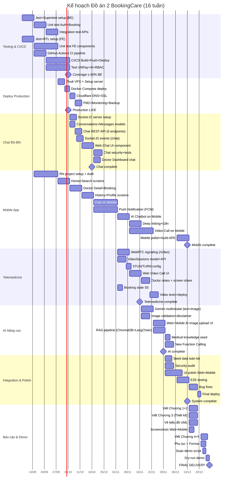

# KẾ HOẠCH THỰC HIỆN GANTT – ĐỒ ÁN 2 BOOKINGCARE
## Phần 2/5: Lịch trình 16 tuần (07/09/2026 – 26/12/2026)

---

## TỔNG QUAN 8 SPRINTS

| Sprint | Tuần | Ngày | Chủ đề chính |
|--------|------|------|-------------|
| Sprint 1 | W1-W2 | 07/09 – 20/09 | Setup + Testing Foundation + CI/CD Base |
| Sprint 2 | W3-W4 | 21/09 – 04/10 | Testing hoàn thiện + Deploy Production |
| Sprint 3 | W5-W6 | 05/10 – 18/10 | Chat BS-BN (Socket.IO) + Mobile App Foundation |
| Sprint 4 | W7-W8 | 19/10 – 01/11 | Chat hoàn thiện + Mobile App Core Screens |
| Sprint 5 | W9-W10 | 02/11 – 15/11 | Telemedicine (WebRTC) + Mobile App Advanced |
| Sprint 6 | W11-W12 | 16/11 – 29/11 | Telemedicine hoàn thiện + AI Chatbot nâng cao |
| Sprint 7 | W13-W14 | 30/11 – 13/12 | AI hoàn thiện + Tích hợp toàn hệ thống + Polish |
| Sprint 8 | W15-W16 | 14/12 – 26/12 | Testing E2E + Viết báo cáo + Chuẩn bị Demo |

---

## CHI TIẾT TỪNG TUẦN

### ══════ SPRINT 1 (W1-W2: 07/09 – 20/09) ══════
**Chủ đề: Setup + Testing Foundation + CI/CD Base**

#### Tuần 1 (07/09 – 13/09)
| Task | Người thực hiện | Dependency | Ghi chú |
|------|----------------|------------|---------|
| Setup Jest + Supertest cho Backend | Giang | — | Test environment, test DB config |
| Viết unit test Auth services (login, register, forgot-pw) | Giang | Jest setup | Mock bcrypt, JWT |
| Setup Jest + React Testing Library cho Frontend | Hải | — | Vite test config |
| Viết unit test frontend components (Header, Login, Register) | Hải | Jest FE setup | Mock Redux store |
| Setup GitHub Actions workflow cơ bản (lint + test) | Giang | Tests exist | `.github/workflows/ci.yml` |
| Research React Native / Expo (PoC) | Hải | — | Đánh giá Expo vs CLI |

#### Tuần 2 (14/09 – 20/09)
| Task | Người thực hiện | Dependency | Ghi chú |
|------|----------------|------------|---------|
| Viết unit test Booking services | Giang | Jest setup | State machine S1→S4 |
| Viết integration test Auth API (Supertest) | Giang | Test DB | Login, register, reset-pw |
| Viết integration test Booking API | Giang | Test DB | Create, verify, cancel |
| Viết unit test thêm FE components (HomePage, DoctorDetail) | Hải | Jest FE | Mock Axios, Redux |
| Setup code coverage reporting (nyc/istanbul) | Giang | Tests | Threshold: 60% BE |
| Khởi tạo project React Native (Expo) | Hải | Research done | Project structure |

> **★ Milestone 1 (20/09):** Backend test coverage ≥ 40%, Frontend test ≥ 20%, CI pipeline chạy tự động trên PR.

---

### ══════ SPRINT 2 (W3-W4: 21/09 – 04/10) ══════
**Chủ đề: Testing hoàn thiện + Deploy Production**

#### Tuần 3 (21/09 – 27/09)
| Task | Người thực hiện | Dependency | Ghi chú |
|------|----------------|------------|---------|
| Viết integration test Payment (VNPay) API | Giang | Test DB | Mock VNPay, IPN |
| Viết integration test Doctor/Patient API | Giang | Test DB | RBAC, IDOR tests |
| Viết unit test AI Chatbot service | Giang | Jest | Mock Gemini SDK |
| CI/CD: Thêm stage Build Docker + Push GHCR | Giang | CI base | Multi-stage build |
| Mobile: Login/Register screens | Hải | RN project | React Navigation |
| Mobile: Redux store setup (reuse slices) | Hải | RN project | Axios config |

#### Tuần 4 (28/09 – 04/10)
| Task | Người thực hiện | Dependency | Ghi chú |
|------|----------------|------------|---------|
| Thuê VPS + Setup server (Ubuntu, Docker, UFW) | Giang | — | DigitalOcean/Vultr |
| Deploy Docker Compose lên VPS | Giang | VPS ready | docker-compose up |
| Cấu hình Cloudflare (DNS, SSL, Tunnels) | Giang | Deploy | Domain + HTTPS |
| Setup PM2 + logging + health check | Giang | Deploy | Monitoring cơ bản |
| Database backup cronjob (pg_dump) | Giang | Deploy | Daily backup |
| Mobile: Home screen + Search | Hải | Redux setup | Reuse API calls |
| CI/CD: Thêm stage Auto-deploy (SSH → VPS) | Giang | Deploy done | On merge to main |

> **★ Milestone 2 (04/10):** Backend test coverage ≥ 60%, Production deployed + domain + SSL, CI/CD full pipeline (lint→test→build→deploy).

---

### ══════ SPRINT 3 (W5-W6: 05/10 – 18/10) ══════
**Chủ đề: Chat BS-BN (Socket.IO) + Mobile App Foundation**

#### Tuần 5 (05/10 – 11/10)
| Task | Người thực hiện | Dependency | Ghi chú |
|------|----------------|------------|---------|
| Backend: Tích hợp Socket.IO vào Express.js | Giang | — | JWT auth middleware |
| Backend: Sequelize models (Conversations, Messages) | Giang | — | Migration + seed |
| Backend: Chat REST API (6 endpoints) | Giang | Models | CRUD + pagination |
| Backend: Socket.IO events (/chat namespace) | Giang | Socket setup | send, receive, typing |
| Mobile: Doctor Detail + Schedule picker | Hải | Home done | Calendar, time slots |
| Mobile: Booking modal + VNPay WebView | Hải | Doctor screen | react-native-webview |

#### Tuần 6 (12/10 – 18/10)
| Task | Người thực hiện | Dependency | Ghi chú |
|------|----------------|------------|---------|
| Frontend Web: Chat UI component (sidebar/drawer) | Hải | Chat API | Message bubbles, input |
| Frontend Web: Socket.IO client integration | Hải | Socket BE | Real-time messages |
| Frontend Web: Typing indicator + read receipts | Hải | Socket | UI updates |
| Frontend Web: Image upload trong chat | Hải | Chat API | Base64, 5MB limit |
| Backend: Chat unit + integration tests | Giang | Chat done | Socket.IO testing |
| Backend: Chat bảo mật (IDOR, rate limit, sanitize) | Giang | Chat done | Security hardening |
| Mobile: History screen (3 tabs) + Review modal | Hải | Booking done | Reuse API |

> **★ Milestone 3 (18/10):** Chat BS-BN hoạt động real-time trên Web, Mobile có 5+ core screens.

---

### ══════ SPRINT 4 (W7-W8: 19/10 – 01/11) ══════
**Chủ đề: Chat hoàn thiện + Mobile App Core**

#### Tuần 7 (19/10 – 25/10)
| Task | Người thực hiện | Dependency | Ghi chú |
|------|----------------|------------|---------|
| Mobile: Chat List screen | Hải | Chat API | Conversation list |
| Mobile: Chat Room screen (Socket.IO) | Hải | Socket.IO | Real-time on mobile |
| Mobile: Image picker (camera/gallery) cho chat | Hải | Chat room | expo-image-picker |
| Backend: Push Notification service (FCM) | Giang | — | Firebase Admin SDK |
| Backend: DeviceTokens model + API (3 endpoints) | Giang | FCM setup | Register, unregister |
| Backend: Trigger notifications (new message, booking change) | Giang | FCM service | Event-driven |

#### Tuần 8 (26/10 – 01/11)
| Task | Người thực hiện | Dependency | Ghi chú |
|------|----------------|------------|---------|
| Mobile: Push notification handling (FCM) | Hải | FCM backend | Foreground/background |
| Mobile: Profile screen + Change password | Hải | Auth done | Reuse API |
| Mobile: AI Chatbot screen (text only) | Hải | AI API | SSE on mobile |
| Mobile: Settings (language, notification prefs) | Hải | — | i18n, toggle |
| Mobile: Deep linking (email verify → app) | Hải | — | expo-linking |
| Backend: Viết tests cho FCM + Chat hoàn thiện | Giang | FCM + Chat | Coverage boost |
| Frontend Web: Chat trong Doctor Dashboard | Giang | Chat UI | BS-side chat view |

> **★ Milestone 4 (01/11):** Chat hoạt động trên cả Web + Mobile, Push notification hoạt động, Mobile App có 10+ screens.

---

### ══════ SPRINT 5 (W9-W10: 02/11 – 15/11) ══════
**Chủ đề: Telemedicine (WebRTC) + Mobile Advanced**

#### Tuần 9 (02/11 – 08/11)
| Task | Người thực hiện | Dependency | Ghi chú |
|------|----------------|------------|---------|
| Backend: Socket.IO /video namespace (signaling) | Giang | Socket.IO | Offer/answer/ICE |
| Backend: VideoSessions model + API (5 endpoints) | Giang | — | Create, join, end |
| Backend: STUN/TURN configuration | Giang | — | Google STUN + coturn |
| Backend: Booking state S5 (Tái khám online) | Giang | — | Allcode + migration |
| Frontend Web: Video Call UI (WebRTC) | Hải | Signaling | Camera, mic, controls |
| Frontend Web: Incoming call notification | Hải | Socket | Modal notification |

#### Tuần 10 (09/11 – 15/11)
| Task | Người thực hiện | Dependency | Ghi chú |
|------|----------------|------------|---------|
| Frontend Web: Doctor notes sau video call | Hải | Video UI | Text area + save |
| Frontend Web: Screen sharing (optional) | Hải | WebRTC | getDisplayMedia |
| Mobile: Video Call screen (react-native-webrtc) | Hải | Signaling | Full-screen video |
| Backend: Notification khi BS tạo video room | Giang | FCM + Video | Push to patient |
| Backend: Tests cho Telemedicine API + Socket | Giang | Video done | Unit + integration |
| Deploy: Cập nhật production với Chat + Video | Giang | All above | Docker rebuild |

> **★ Milestone 5 (15/11):** Video call P2P hoạt động trên Web, Mobile video call MVP, Chat + Video trên production.

---

### ══════ SPRINT 6 (W11-W12: 16/11 – 29/11) ══════
**Chủ đề: Telemedicine Polish + AI Chatbot nâng cao**

#### Tuần 11 (16/11 – 22/11)
| Task | Người thực hiện | Dependency | Ghi chú |
|------|----------------|------------|---------|
| Backend: Gemini multimodal (text + image) | Giang | AI existing | Cập nhật aiController |
| Backend: Image validation (5MB, MIME type) | Giang | Multimodal | Security |
| Backend: Medical disclaimer system | Giang | — | Auto-append |
| Backend: Rate limit riêng cho multimodal | Giang | — | Tốn token hơn |
| Frontend Web: AI Chat upload ảnh UI | Hải | Multimodal API | Drag-drop, preview |
| Mobile: AI Chat upload ảnh (camera/gallery) | Hải | Multimodal API | Image picker + SSE |

#### Tuần 12 (23/11 – 29/11)
| Task | Người thực hiện | Dependency | Ghi chú |
|------|----------------|------------|---------|
| Backend: RAG pipeline setup (ChromaDB + LangChain) | Giang | — | Knowledge base y tế |
| Backend: Seed medical knowledge data | Giang | ChromaDB | Bệnh, triệu chứng, CK |
| Backend: Function Calling mới (getSpecialtyRecommendation) | Giang | RAG | AI gợi ý chuyên khoa |
| Frontend Web: AI response + specialty suggestion links | Hải | FC mới | Direct booking link |
| Mobile: Video call polish (UI, reconnect, edge cases) | Hải | Video MVP | UX improvements |
| Mobile: Notification center screen | Hải | FCM | In-app notification list |

> **★ Milestone 6 (29/11):** AI Chatbot hỗ trợ phân tích ảnh, RAG knowledge base hoạt động, Mobile App feature-complete.

---

### ══════ SPRINT 7 (W13-W14: 30/11 – 13/12) ══════
**Chủ đề: Tích hợp toàn hệ thống + Polish + Seed Data**

#### Tuần 13 (30/11 – 06/12)
| Task | Người thực hiện | Dependency | Ghi chú |
|------|----------------|------------|---------|
| Backend: Seed data cho tất cả tính năng mới | Giang | All features | Conversations, messages, video sessions |
| Backend: createBookingDraft Function Calling | Giang | AI + Booking | Nháp booking từ chat |
| Backend: Security audit toàn hệ thống | Giang | All features | Penetration testing cơ bản |
| Frontend Web: UI polish toàn bộ tính năng mới | Hải | All features | Responsive, i18n |
| Mobile: UI polish toàn bộ screens | Hải | All screens | Animation, loading states |
| Mobile: Đa ngôn ngữ (Việt-Anh) | Hải | i18n files | Reuse translation |

#### Tuần 14 (07/12 – 13/12)
| Task | Người thực hiện | Dependency | Ghi chú |
|------|----------------|------------|---------|
| End-to-end testing toàn luồng (Web) | Cả hai | All features | Manual testing checklist |
| End-to-end testing toàn luồng (Mobile) | Cả hai | All features | Test trên emulator + device |
| Fix bugs từ E2E testing | Cả hai | E2E results | Priority: Critical → High |
| Deploy final version lên production | Giang | Bug fixes | Docker rebuild |
| Build APK release (Android) | Hải | Mobile done | expo build / eas build |
| Cập nhật tests cho tính năng mới | Giang | New features | Maintain coverage |

> **★ Milestone 7 (13/12):** Hệ thống hoàn chỉnh (Web + Mobile + Production), APK release, All features tested.

---

### ══════ SPRINT 8 (W15-W16: 14/12 – 26/12) ══════
**Chủ đề: Viết báo cáo + Chuẩn bị Demo**

#### Tuần 15 (14/12 – 20/12)
| Task | Người thực hiện | Dependency | Ghi chú |
|------|----------------|------------|---------|
| Viết báo cáo Chương 1 + Chương 2 | Hải | — | Giới thiệu + Lý thuyết |
| Viết báo cáo Chương 3 (Phân tích & Thiết kế) | Giang | — | UC, DB, API, Sequence diagrams |
| Vẽ biểu đồ: Use Case, Sequence, ER Diagram cập nhật | Giang | — | PlantUML / draw.io |
| Chụp screenshots tất cả màn hình (Web + Mobile) | Hải | — | Cho Chương 4 |
| Export test coverage reports | Giang | — | Cho Phụ lục D |

#### Tuần 16 (21/12 – 26/12)
| Task | Người thực hiện | Dependency | Ghi chú |
|------|----------------|------------|---------|
| Viết báo cáo Chương 4 (Triển khai) | Hải | Screenshots | Mô tả màn hình + code |
| Viết báo cáo Chương 5 (Kết luận) | Giang | — | So sánh, đánh giá |
| Viết Phụ lục (A-E) | Cả hai | All docs | Setup guide, API docs |
| Soạn kịch bản demo (20-25 phút) | Cả hai | — | Phân vai, chuẩn bị data |
| Tập demo dry-run (ít nhất 2 lần) | Cả hai | Script | Fix lỗi demo |
| Review báo cáo cuối cùng + Format | Cả hai | All chapters | Chỉnh sửa, đánh mục lục |

> **★ Milestone 8 (26/12):** Báo cáo hoàn chỉnh (100-120 trang), Demo sẵn sàng, Production URL hoạt động, APK release.

---

## GANTT CHART (Mermaid)



---

## TÓM TẮT DEPENDENCIES CHÍNH

```
Testing (W1-W4) ─────────────────────────────────────────────┐
CI/CD (W2-W4) ───────────────────────────────────────────────┤
Deploy (W4) ─────────────────────────────────────────────────┤
    └── Socket.IO setup (W5) ────────────────────────────────┤
        ├── Chat BS-BN (W5-W8) ──────────────────────────────┤
        │   └── Chat on Mobile (W7-W8)                       │
        └── WebRTC Signaling (W9-W10) ───────────────────────┤
            ├── Video Call Web (W9-W10)                      │
            └── Video Call Mobile (W10-W12)                  │
                                                             │
Mobile App Foundation (W2-W6) ───────────────────────────────┤
    └── Mobile Advanced (W7-W12) ────────────────────────────┤
        └── FCM Push Notification (W7-W8) ───────────────────┤
                                                             │
AI Multimodal (W11-W12) ─────────────────────────────────────┤
    └── RAG Pipeline (W12) ──────────────────────────────────┤
                                                             │
Integration + Polish (W13-W14) ──── All above ───────────────┤
Báo cáo + Demo (W15-W16) ───────── System complete ─────────┘
```
