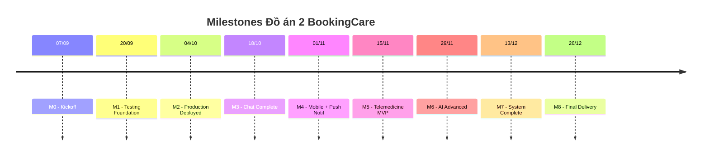

# MILESTONES & DELIVERABLES – ĐỒ ÁN 2 BOOKINGCARE
## Phần 4/5: Mốc quan trọng & Sản phẩm bàn giao

---

## TỔNG QUAN MILESTONES

---

## CHI TIẾT TỪNG MILESTONE

### ★ M0 – Kickoff (07/09/2026)

| Hạng mục | Chi tiết |
|----------|---------|
| **Deliverables** | Đề cương được phê duyệt, repository sẵn sàng, task board setup |
| **Tiêu chí hoàn thành** | ✅ Đề cương nộp GVHD ✅ GitHub repo có branch strategy (main, develop, feature/*) ✅ GitHub Projects/Issues board tạo với backlog ✅ Team đã thống nhất tech stack + coding conventions |
| **Rủi ro** | Đề cương chưa được duyệt → Bắt đầu code song song, điều chỉnh sau |

---

### ★ M1 – Testing Foundation (20/09/2026)

| Hạng mục | Chi tiết |
|----------|---------|
| **Deliverables** | Test suite Backend + Frontend, CI pipeline tự động |
| **Tiêu chí hoàn thành** | ✅ Jest + Supertest configured cho Backend ✅ 50+ unit test cases cho Auth + Booking services ✅ Jest + React Testing Library configured cho Frontend ✅ 18+ unit test cases cho FE components ✅ GitHub Actions CI chạy tự động trên mỗi PR (lint + test) ✅ Code coverage report generated (BE ≥ 40%) |
| **Sản phẩm cụ thể** | `jest.config.js`, `vitest.config.js`, `.github/workflows/ci.yml`, coverage report HTML |

---

### ★ M2 – Production Deployed + CI/CD Complete (04/10/2026)

| Hạng mục | Chi tiết |
|----------|---------|
| **Deliverables** | Production URL live, full CI/CD pipeline, Backend coverage ≥ 60% |
| **Tiêu chí hoàn thành** | ✅ VPS server hoạt động (DigitalOcean/Vultr/Hetzner) ✅ Docker Compose deploy thành công (4 containers) ✅ Domain + SSL configured (Cloudflare) ✅ Production URL truy cập được (HTTPS) ✅ PM2 process manager + health check endpoint ✅ Database backup cronjob hàng ngày ✅ CI/CD pipeline hoàn chỉnh: lint → test → build → push Docker → auto-deploy ✅ Backend test coverage ≥ 60% ✅ 40+ integration test cases (Auth, Booking, Payment, Doctor, Patient API) ✅ React Native project khởi tạo + Login/Register screens |
| **Sản phẩm cụ thể** | Production URL (e.g., `bookingcare.example.com`), CI/CD workflow files, VPS access credentials, Mobile project skeleton |

---

### ★ M3 – Chat BS-BN Complete (18/10/2026)

| Hạng mục | Chi tiết |
|----------|---------|
| **Deliverables** | Chat real-time hoạt động trên Web, Mobile có 5+ core screens |
| **Tiêu chí hoàn thành** | ✅ Socket.IO server tích hợp vào Express.js ✅ 2 bảng mới (Conversations, Messages) với migration + seed ✅ 6 Chat REST API endpoints hoạt động ✅ Socket.IO events: send_message, new_message, typing, read_receipt ✅ Web UI: Chat sidebar, message bubbles, typing indicator, image upload ✅ Chat bảo mật: IDOR prevention, rate limiting, content sanitization ✅ Chat tests (unit + integration) ✅ Doctor Dashboard có chat view ✅ Mobile: Home, Search, Doctor Detail, Booking, History screens hoạt động |
| **Sản phẩm cụ thể** | Chat module (BE + FE), Socket.IO server, 5 Mobile screens, demo video chat |

---

### ★ M4 – Mobile + Push Notification (01/11/2026)

| Hạng mục | Chi tiết |
|----------|---------|
| **Deliverables** | Mobile App 10+ screens, Chat trên Mobile, Push Notification hoạt động |
| **Tiêu chí hoàn thành** | ✅ Mobile: Chat List + Chat Room screens (Socket.IO real-time) ✅ Mobile: Image picker (camera/gallery) cho chat ✅ Firebase Cloud Messaging tích hợp (Backend + Mobile) ✅ DeviceTokens model + 3 API endpoints ✅ Push notifications: tin nhắn mới, booking thay đổi, video call invite ✅ Mobile: Profile + Change Password screens ✅ Mobile: AI Chatbot screen (text only, SSE streaming) ✅ Mobile: Deep linking (email verify → app open) ✅ Mobile: 10+ screens tổng cộng hoạt động ✅ Production updated với Chat feature |
| **Sản phẩm cụ thể** | Mobile APK debug build, FCM setup, Deep link configuration |

---

### ★ M5 – Telemedicine MVP (15/11/2026)

| Hạng mục | Chi tiết |
|----------|---------|
| **Deliverables** | Video Call P2P hoạt động trên Web, MVP trên Mobile |
| **Tiêu chí hoàn thành** | ✅ WebRTC signaling server (Socket.IO /video namespace) ✅ VideoSessions model + 5 API endpoints ✅ STUN/TURN servers configured ✅ Booking state S5 (Tái khám online) added ✅ Web: Video call page (camera, mic, controls, end call) ✅ Web: Incoming call notification modal ✅ Web: Doctor notes form sau video call ✅ Web: Screen sharing (optional, nice-to-have) ✅ Mobile: Video call screen (react-native-webrtc) ✅ Push notification khi BS tạo video room ✅ Tests cho Telemedicine API ✅ Production updated với Video Call |
| **Sản phẩm cụ thể** | Video Call module (BE signaling + FE Web + FE Mobile), demo video cuộc gọi BS↔BN |

---

### ★ M6 – AI Advanced (29/11/2026)

| Hạng mục | Chi tiết |
|----------|---------|
| **Deliverables** | AI Chatbot phân tích ảnh, RAG knowledge base, Mobile feature-complete |
| **Tiêu chí hoàn thành** | ✅ Gemini multimodal (text + image) hoạt động ✅ Image validation (5MB, MIME type check) ✅ Medical disclaimer auto-append ✅ Rate limit riêng cho multimodal requests ✅ RAG pipeline (ChromaDB + LangChain.js) hoạt động ✅ Medical knowledge base seeded (bệnh, triệu chứng, chuyên khoa) ✅ Function Calling mới: getSpecialtyRecommendation ✅ Web: AI chat upload ảnh (drag-drop, preview) ✅ Web: AI response với specialty suggestion links ✅ Mobile: AI chat upload ảnh (camera/gallery) ✅ Mobile: Video call polished (reconnect, edge cases) ✅ Mobile: Notification center + Settings screens |
| **Sản phẩm cụ thể** | AI multimodal module, ChromaDB vector store, medical KB data, demo AI phân tích ảnh |

---

### ★ M7 – System Complete (13/12/2026)

| Hạng mục | Chi tiết |
|----------|---------|
| **Deliverables** | Hệ thống hoàn chỉnh, tested, deployed, APK release |
| **Tiêu chí hoàn thành** | ✅ createBookingDraft Function Calling hoạt động ✅ Seed data đầy đủ tất cả tính năng mới ✅ Security audit passed (no critical vulnerabilities) ✅ UI polish Web: responsive, i18n, animations ✅ UI polish Mobile: loading states, error handling, animations ✅ Mobile đa ngôn ngữ Việt-Anh hoàn thiện ✅ E2E testing Web passed (all flows) ✅ E2E testing Mobile passed (emulator + device) ✅ All critical + high bugs fixed ✅ Final production deployed ✅ Android APK release build |
| **Sản phẩm cụ thể** | Final codebase, APK file, E2E test report, security audit report |

---

### ★ M8 – Final Delivery (26/12/2026)

| Hạng mục | Chi tiết |
|----------|---------|
| **Deliverables** | Báo cáo hoàn chỉnh, Demo sẵn sàng |
| **Tiêu chí hoàn thành** | ✅ Báo cáo 100-120 trang (5 chương + phụ lục) ✅ Biểu đồ UML cập nhật (Use Case, Sequence ×5, ER, Class) ✅ Screenshots tất cả màn hình Web + Mobile ✅ Test coverage reports (BE ≥ 60%, FE ≥ 40%) ✅ API documentation (Postman collection hoặc Swagger) ✅ Kịch bản demo 20-25 phút soạn xong ✅ Dry-run demo ít nhất 2 lần ✅ Production URL hoạt động ổn định ✅ APK file sẵn sàng demo ✅ Source code pushed to GitHub (clean, documented) |
| **Sản phẩm bàn giao cuối cùng** | 1. Báo cáo (PDF + DOCX) 2. Source code (GitHub repos: frontend, backend, mobile) 3. APK release 4. Production URL 5. Demo video (backup) 6. Postman collection / API docs |

---

## BẢNG TỔNG HỢP MILESTONES

| Milestone | Ngày | Tuần | Sprint | Deliverable chính | Gate (phải pass) |
|-----------|------|------|--------|-------------------|-----------------|
| M0 | 07/09 | W0 | — | Kickoff, đề cương | Đề cương approved |
| M1 | 20/09 | W2 | S1 | Testing foundation | CI pipeline chạy |
| M2 | 04/10 | W4 | S2 | Production deployed | URL live + HTTPS |
| M3 | 18/10 | W6 | S3 | Chat BS-BN | Real-time chat works |
| M4 | 01/11 | W8 | S4 | Mobile + FCM | 10+ mobile screens |
| M5 | 15/11 | W10 | S5 | Telemedicine | Video call P2P works |
| M6 | 29/11 | W12 | S6 | AI Advanced | Image analysis works |
| M7 | 13/12 | W14 | S7 | System complete | E2E tests pass |
| M8 | 26/12 | W16 | S8 | Final delivery | Report + Demo ready |

---

## SCOPE MVP vs FULL

| Hướng phát triển | MVP (Bắt buộc hoàn thành) | Full (Nice-to-have) |
|-----------------|--------------------------|-------------------|
| **Mobile App** | Patient: Home, Search, Doctor, Booking, History, Chat, Profile, AI Chat (12 screens) | Doctor screens, iOS build (IPA), tablet layout |
| **CI/CD** | Lint → Test → Build → Deploy cho Backend+Frontend | Mobile CI (EAS Build), Dependabot, staging env |
| **Telemedicine** | 1-1 video call (BS↔BN), doctor notes, S5 status | Screen sharing, recording, group call |
| **Testing** | BE coverage ≥ 60%, FE coverage ≥ 40%, integration tests | E2E automated tests (Cypress/Playwright), load testing |
| **AI nâng cao** | Multimodal (text+image), medical disclaimer | RAG full pipeline, createBookingDraft FC |
| **Chat BS-BN** | Text + image messages, typing indicator, read receipts | Voice messages, file attachments, message search |
| **Deploy** | VPS + Docker + Domain + SSL | Kubernetes, multi-region, CDN for assets |
