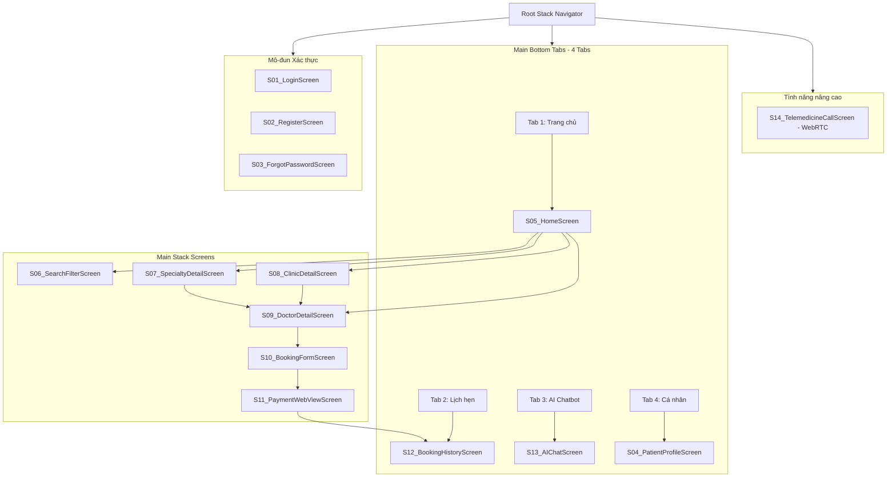

# 📱 THIẾT KẾ CHI TIẾT & KẾ HOẠCH PHÁT TRIỂN ỨNG DỤNG DI ĐỘNG (MOBILE APP) BOOKINGCARE

> **Dự án:** BookingCare – Hệ thống đặt lịch khám bệnh trực tuyến  
> **Tài liệu:** Đồ án 2 (UIT) – Phase 0: Chuẩn bị  
> **Phiên bản:** 1.0 | **Ngày tạo:** 01/09/2026  
> **Tác giả:** Đặng Ngọc Trường Giang & Trần Đức Hải  
> **Công nghệ:** React Native (Cross-platform iOS & Android) + Redux Toolkit + React Navigation v6  
> **Vị trí file:** `DOCS-DoAn2/Phase0-ChuanBi/07_KeHoach_ThietKe_ManHinh_Mobile.md`

---

## MỤC LỤC

1. [Tổng quan & Mục tiêu ứng dụng Mobile App](#1-tổng-quan--mục-tiêu-ứng-dụng-mobile-app)
2. [Kiến trúc Kỹ thuật & Tech Stack Mobile](#2-kiến-trúc-kỹ-thuật--tech-stack-mobile)
3. [Bảng Ma trận Ánh xạ Màn hình Web ↔ Mobile](#3-bảng-ma-trận-ánh-xạ-màn-hình-web--mobile)
4. [Đặc tả Chi tiết 14 Màn hình Mobile (Mobile Screen Specs)](#4-đặc-tả-chi-tiết-14-màn-hình-mobile-mobile-screen-specs)
   - [Mô-đun 1: Xác thực & Hồ sơ (S01 – S04)](#mô-đun-1-xác-thực--hồ-sơ-s01--s04)
   - [Mô-đun 2: Khám phá & Tìm kiếm (S05 – S08)](#mô-đun-2-khám-phá--tìm-kiếm-s05--s08)
   - [Mô-đun 3: Chi tiết Bác sĩ & Luồng Đặt lịch (S09 – S11)](#mô-đun-3-chi-tiết-bác-sĩ--luồng-đặt-lịch-s09--s11)
   - [Mô-đun 4: Quản lý Lịch hẹn, AI Chatbot & Telemedicine (S12 – S14)](#mô-đun-4-quản-lý-lịch-hẹn-ai-chatbot--telemedicine-s12--s14)
5. [Sơ đồ Luồng Điều hướng (Navigation Flow & Routing Graph)](#5-sơ-đồ-luồng-điều-hướng-navigation-flow--routing-graph)
6. [Thiết kế Hệ thống UI/UX Design System Mobile](#6-thiết-kế-hệ-thống-uiux-design-system-mobile)
7. [Tích hợp API Backend & Quản lý Trạng thái (Redux & Caching)](#7-tích- hợp-api-backend--quản-lý-trạng-thái-redux--caching)
8. [Kế hoạch Triển khai theo Sprint (W3 – W14)](#8-kế-hoạch-triển-khai-theo-sprint-w3--w14)
9. [Kế hoạch Kiểm thử & Tối ưu Năng suất (Performance Optimization)](#9-kế-hoạch-kiểm-thử--tối-ưu-năng-suất-performance-optimization)

---

## 1. TỔNG QUAN & MỤC TIÊU ỨNG DỤNG MOBILE APP

### 1.1. Bối cảnh
Trong Đồ án 1, hệ thống BookingCare đã hoàn thiện phiên bản Web Application dành cho 3 nhóm người dùng (Bệnh nhân, Bác sĩ, Quản trị viên). Tuy nhiên, đối với người bệnh, việc sử dụng thiết bị di động mang lại sự tiện lợi vượt trội trong các ngữ cảnh:
- Tìm kiếm bác sĩ và đặt lịch khám nhanh chóng mọi lúc mọi nơi.
- Nhận thông báo Push Notification nhắc lịch khám, kết quả khám.
- Chat trực tiếp với Bác sĩ hoặc Trợ lý Y tế AI Chatbot qua thiết bị cầm tay.
- Thực hiện cuộc gọi Video Telemedicine 1-1 với Bác sĩ qua camera điện thoại.

### 1.2. Mục tiêu chiến lược
1. **Trải nghiệm di động nguyên bản (Native UX):** Xây dựng ứng dụng mượt mà, phản hồi tức thì dưới 100ms trên cả 2 hệ điều hành Android và iOS.
2. **Đồng bộ 100% với Web & Backend:** Sử dụng chung hệ thống RESTful API `/api/v1/` và cơ sở dữ liệu PostgreSQL hiện có.
3. **Phủ rộng 14 màn hình di động chuyên sâu:** Đáp ứng toàn bộ tính năng dành cho Bệnh nhân (Patient App), mở rộng thêm các tính năng đặc thù di động (Mã QR Check-in, Push Notification, WebRTC Video Call).

---

## 2. KIẾN TRÚC KỸ THUẬT & TECH STACK MOBILE

### 2.1. Tech Stack Chi tiết

| Tầng / Thành phần | Công nghệ / Thư viện | Version | Mục đích sử dụng |
|-------------------|----------------------|---------|------------------|
| **Core Framework** | React Native (CLI / Expo Bare Workflow) | `^0.74.x` | Xây dựng ứng dụng di động đa nền tảng |
| **Language** | TypeScript / JavaScript (ES6+) | `^5.x` | Đảm bảo Type Safety & hỗ trợ nhắc code |
| **Navigation** | React Navigation (Stack + Bottom Tabs) | `^6.x` | Quản lý luồng chuyển màn hình & tabbar native |
| **State Management** | Redux Toolkit + Redux Persist | `^2.x` | Quản lý global state (Auth, Cart, Bookings) & offline storage |
| **HTTP Client** | Axios + Interceptors | `^1.x` | Gọi REST API, tự động đính kèm JWT & refresh token |
| **Styling** | NativeWind (TailwindCSS cho RN) / StyleSheet | `^4.x` | Thiết kế UI responsive, hiện đại, hỗ trợ Dark Mode |
| **UI Components** | React Native Paper / Lucide React Native | `^5.x` | Bộ icon và component UI UI/UX chuẩn Material |
| **Realtime Chat** | Socket.IO Client | `^4.x` | Kết nối Chat 1-1 Bác sĩ - Bệnh nhân realtime |
| **AI Stream** | Fetch Event Source / React Native EventSource | `^1.x` | Nhận phản hồi SSE stream từ AI Chatbot Gemini |
| **Telemedicine** | react-native-webrtc | `^118.x` | Truyền tải âm thanh/video thời gian thực WebRTC 1-1 |
| **Payment Gateway** | React Native WebView | `^13.x` | Nhúng cổng thanh toán VNPay Sandbox |
| **Push Notification** | Firebase Cloud Messaging (FCM) / Notifee | `^20.x` | Gửi thông báo nhắc lịch khám, mã xác nhận |
| **Media & QR** | react-native-qrcode-svg / react-native-image-picker | `^6.x` | Quét/Tạo mã QR Check-in & Chọn ảnh upload |

### 2.2. Kiến trúc Thư mục Dự án Mobile (`bookingcare-mobile/`)

```
bookingcare-mobile/
├── assets/                  # Hình ảnh tĩnh, fonts, biểu tượng app
│   ├── fonts/               # Inter, Roboto fonts
│   └── images/              # Banner, logo, default avatar
├── src/
│   ├── api/                 # Axios client, Auth API, Booking API, AI API
│   ├── components/          # Reusable UI components
│   │   ├── common/          # Button, Input, Card, Header, Loading, Badge
│   │   ├── doctor/          # DoctorCard, ScheduleTimeGrid, RatingStars
│   │   ├── booking/         # BookingStatusBadge, ReceiptCard, QRCodeModal
│   │   └── chat/            # ChatBubble, StreamText, AttachmentPicker
│   ├── config/              # Constants, Theme colors, Environment vars
│   ├── hooks/               # Custom React hooks (useAuth, useFetch, useSocket)
│   ├── navigation/          # AppNavigator, AuthStack, MainTabNavigator, RootStack
│   ├── redux/               # Redux Slices (authSlice, bookingSlice, aiSlice)
│   ├── screens/             # 14 Màn hình chính
│   │   ├── auth/            # S01_Login, S02_Register, S03_ForgotPassword
│   │   ├── home/            # S05_Home, S06_SearchFilter
│   │   ├── specialty/       # S07_SpecialtyDetail
│   │   ├── clinic/          # S08_ClinicDetail
│   │   ├── doctor/          # S09_DoctorDetail
│   │   ├── booking/         # S10_BookingForm, S11_PaymentWebView, S12_BookingHistory
│   │   ├── profile/         # S04_PatientProfile
│   │   └── features/        # S13_AIChat, S14_TelemedicineCall
│   ├── services/            # FCM Notification Service, WebRTC Peer Service
│   ├── utils/               # Date format, Currency format, Validation rules
│   └── App.tsx              # Root component & Providers setup
├── index.js
├── package.json
└── tsconfig.json
```

---

## 3. BẢNG MA TRẬN ÁNH XẠ MÀN HÌNH WEB ↔ MOBILE

| # | Màn hình Web tương ứng | Màn hình Mobile App (React Native) | Mã MH | Phân vùng Navigation | Vai trò & Mục đích chính |
|---|------------------------|------------------------------------|-------|----------------------|--------------------------|
| 1 | Màn hình / Modal Đăng nhập (`/login`) | `LoginScreen` | **S01** | Auth Stack | Đăng nhập tài khoản Bệnh nhân qua Email & Mật khẩu |
| 2 | Trang Đăng ký Bệnh nhân (`/register`) | `RegisterScreen` | **S02** | Auth Stack | Đăng ký tài khoản Bệnh nhân mới (R3) |
| 3 | Modal Quên mật khẩu | `ForgotPasswordScreen` | **S03** | Auth Stack | Khôi phục mật khẩu qua Email OTP/Token |
| 4 | Trang Hồ sơ cá nhân (`/patient/profile`) | `PatientProfileScreen` | **S04** | Main Bottom Tab 4 | Quản lý thông tin cá nhân, Đổi mật khẩu, Avatar |
| 5 | Trang chủ Web (`/`) | `HomeScreen` | **S05** | Main Bottom Tab 1 | Trang chủ: Banner, Danh mục, Bác sĩ/PK nổi bật, Shortcut |
| 6 | Trang Tìm kiếm & Lọc (`/search`) | `SearchFilterScreen` | **S06** | Main Tab / Stack | Tìm kiếm đa năng Bác sĩ, Chuyên khoa, Bệnh viện |
| 7 | Chi tiết Chuyên khoa (`/specialties/:id`) | `SpecialtyDetailScreen` | **S07** | Main Stack | Xem thông tin chuyên khoa & danh sách Bác sĩ thuộc khoa |
| 8 | Chi tiết Cơ sở y tế (`/clinics/:id`) | `ClinicDetailScreen` | **S08** | Main Stack | Xem thông tin phòng khám/bệnh viện & danh sách Bác sĩ |
| 9 | Chi tiết Bác sĩ (`/doctors/:id`) | `DoctorDetailScreen` | **S09** | Main Stack | Thông tin bác sĩ, chọn Ngày & Khung giờ khám, Đánh giá |
| 10 | Modal / Form Đặt lịch khám | `BookingFormScreen` | **S10** | Main Stack | Form nhập lý do khám, chọn người khám, chọn thanh toán |
| 11 | Cổng thanh toán VNPay / Kết quả | `PaymentWebViewScreen` | **S11** | Main Stack | Webview thanh toán VNPay & Màn hình Receipt QR Code |
| 12 | Quản lý lịch đặt (`/patient/bookings`) | `BookingHistoryScreen` | **S12** | Main Bottom Tab 2 | Xem danh sách lịch hẹn (S1, S2, S3, S4), hủy lịch, review |
| 13 | Drawer AI Chatbot Gemini | `AIChatScreen` | **S13** | Main Bottom Tab 3 | Chatbot tư vấn y tế AI stream SSE, gợi ý Bác sĩ |
| 14 | Telemedicine Call (WebRTC) | `TelemedicineCallScreen` | **S14** | Fullscreen Overlay | Cuộc gọi Video 1-1 thời gian thực với Bác sĩ |

---

## 4. ĐẶC TẢ CHI TIẾT 14 MÀN HÌNH MOBILE (MOBILE SCREEN SPECS)

---

### MÔ-ĐUN 1: XÁC THỰC & HỒ SƠ (S01 – S04)

#### 🔷 S01 – LoginScreen (Màn hình Đăng nhập)
- **Mục tiêu:** Cho phép Bệnh nhân đăng nhập vào hệ thống để lấy mã xác thực JWT.
- **Layout UI Components:**
  - Header: Logo BookingCare + Nút Bỏ qua (Chế độ Guest xem thông tin).
  - Form Fields: `TextInput` Email (auto-lowercase, icon Mail) + `TextInput` Mật khẩu (icon Lock, nút Ẩn/Hiện mật khẩu).
  - Checkbox "Ghi nhớ đăng nhập" + Text Button "Quên mật khẩu?".
  - Primary Button: "ĐĂNG NHẬP" (Gradient xanh lá/cyan, hiệu ứng Loading spinner khi submitting).
  - Footer: "Chưa có tài khoản? **Đăng ký ngay**".
- **API Endpoint:** `POST /api/v1/auth/login`
- **State Management:**
  - Redux: dispatch `loginSuccess({ user, token })`, lưu JWT vào SecureStore/AsyncStorage.
- **UX Rules & Security:**
  - Validate email format & password length ≥ 6 ký tự client-side trước khi gửi API.
  - Xử lý lỗi Rate-limit (HTTP 429) hiển thị Toast thông báo.

#### 🔷 S02 – RegisterScreen (Màn hình Đăng ký)
- **Mục tiêu:** Tạo tài khoản Bệnh nhân mới (`roleId: 'R3'`).
- **Layout UI Components:**
  - Navigation Top Bar: Nút Back + Tiêu đề "Tạo tài khoản mới".
  - Input Fields: Họ và Tên, Số điện thoại (Phone input format), Email, Mật khẩu, Nhập lại mật khẩu.
  - Radio Button / Segmented Control: Chọn Giới tính (Nam / Nữ / Khác).
  - Primary Button: "ĐĂNG KÝ TÀI KHOẢN".
- **API Endpoint:** `POST /api/v1/auth/register`
- **UX Rules:** Auto login sau khi đăng ký thành công hoặc chuyển sang màn hình Login với thông báo thành công.

#### 🔷 S03 – ForgotPasswordScreen (Màn hình Quên mật khẩu)
- **Mục tiêu:** Yêu cầu gửi email khôi phục mật khẩu cho Bệnh nhân.
- **Layout UI Components:**
  - Hình minh họa (Vector Icon chìa khóa/bảo mật).
  - Text hướng dẫn: "Nhập email đã đăng ký để nhận liên kết đặt lại mật khẩu".
  - Input Field: Email.
  - Button: "GỬI YÊU CẦU KHÔI PHỤC".
- **API Endpoint:** `POST /api/v1/auth/forgot-password`

#### 🔷 S04 – PatientProfileScreen (Màn hình Hồ sơ cá nhân)
- **Mục tiêu:** Xem & chỉnh sửa thông tin cá nhân của bệnh nhân (`R3`).
- **Layout UI Components:**
  - Header Section: Avatar hình tròn (có nút camera đổi ảnh) + Họ tên + Badge "Bệnh nhân".
  - Info Form: Họ tên, Số điện thoại, Email (Disabled), Địa chỉ, Giới tính, Ngày sinh (DatePicker Modal).
  - Action Menu Buttons:
    - 🔒 Đổi mật khẩu
    - 📜 Lịch sử khám bệnh
    - 🌐 Đổi ngôn ngữ (Tiếng Việt / English)
    - 🚪 Đăng xuất (Hiển thị Confirmation Alert Popup)
- **API Endpoints:**
  - `GET /api/v1/patient/profile`
  - `PUT /api/v1/patient/profile`
- **Xử lý Ảnh Avatar:** Chọn ảnh từ Thư viện/Camera → Convert Base64 (strip prefix) → Gửi `image` qua API `PUT`.

---

### MÔ-ĐUN 2: KHÁM PHÁ & TÌM KIẾM (S05 – S08)

#### 🔷 S05 – HomeScreen (Màn hình Trang chủ)
- **Mục tiêu:** Trung tâm điều hướng & hiển thị nội dung nổi bật cho bệnh nhân.
- **Layout UI Components (Top to Bottom):**
  - **Custom Header:** Logo + Welcome text + Icon Chuông thông báo (badge số lượng) + Avatar góc phải.
  - **Search Bar (Touchable Input):** Bấm vào tự động chuyển sang `SearchFilterScreen` (S06).
  - **Quick Action Grid (4 Icons):** [Đặt lịch khám] - [Tư vấn AI Chatbot] - [Khám từ xa Telemedicine] - [Lịch hẹn của tôi].
  - **Banner Carousel:** Banner khuyến mãi / giới thiệu dịch vụ (Auto-scroll 4 giây).
  - **Section 1: Chuyên khoa nổi bật (Horizontal FlatList):**
    - Item Card: Image icon + Tên chuyên khoa (Bấm vào → S07 `SpecialtyDetailScreen`).
  - **Section 2: Cơ sở y tế hàng đầu (Horizontal FlatList):**
    - Item Card: Ảnh bệnh viện + Tên bệnh viện + Địa chỉ (Bấm vào → S08 `ClinicDetailScreen`).
  - **Section 3: Bác sĩ nổi bật (Horizontal FlatList):**
    - Item Card: Avatar bác sĩ + Học hàm/Học vị + Họ tên + Chuyên khoa (Bấm vào → S09 `DoctorDetailScreen`).
- **API Endpoints:**
  - `GET /api/v1/specialties?limit=10`
  - `GET /api/v1/clinics?limit=10`
  - `GET /api/v1/doctors/top?limit=10`
- **UX Features:** Pull-to-Refresh để cập nhật danh sách mới nhất.

#### 🔷 S06 – SearchFilterScreen (Màn hình Tìm kiếm & Lọc)
- **Mục tiêu:** Tìm kiếm nhanh Bác sĩ, Chuyên khoa, Bệnh viện theo từ khóa & bộ lọc.
- **Layout UI Components:**
  - Header: Search Input với nút Clear (X) + Nút Hủy.
  - Filter Chips (Tabs): `Tất cả` | `Bác sĩ` | `Chuyên khoa` | `Cơ sở y tế`.
  - Results List (`FlatList`):
    - Doctor Item: Avatar + Tên + Chuyên khoa + Học vị + Nút "Đặt lịch".
    - Specialty / Clinic Item: Ảnh đại diện + Tên + Mô tả ngắn.
  - Empty State: Hình minh họa "Không tìm thấy kết quả phù hợp" khi kết quả rỗng.
- **API Endpoint:** `GET /api/v1/search?keyword=...` (Debounce 400ms khi gõ).

#### 🔷 S07 – SpecialtyDetailScreen (Màn hình Chi tiết Chuyên khoa)
- **Mục tiêu:** Hiển thị thông tin mô tả chuyên khoa và danh sách Bác sĩ thuộc chuyên khoa đó.
- **Layout UI Components:**
  - Top Bar: Nút Back + Tên Chuyên khoa.
  - Collapsible Header: Mô tả chuyên khoa (HTML renderer với nút "Xem thêm / Thu gọn").
  - Filter Province Dropdown: Chọn Tỉnh/Thành phố (`Tất cả`, `Hà Nội`, `TP. Hồ Chí Minh`).
  - List Doctors (`FlatList`): Card từng Bác sĩ chứa Avatar, Tên, Giá khám, Lịch khám dạng Tab ngày selector.
- **API Endpoints:**
  - `GET /api/v1/specialties/:id`
  - `GET /api/v1/doctors/:doctorId/schedules?date=...`

#### 🔷 S08 – ClinicDetailScreen (Màn hình Chi tiết Cơ sở Y tế)
- **Mục tiêu:** Cung cấp thông tin bệnh viện/phòng khám, địa chỉ, hình ảnh và danh sách Bác sĩ làm việc tại đó.
- **Layout UI Components:**
  - Cover Image Banner + Logo Bệnh viện.
  - Thông tin chung: Tên bệnh viện, Địa chỉ (icon Map marker + nút "Chỉ đường" mở Google Maps/Apple Maps).
  - Segmented Control Tabs: `Giới thiệu` | `Danh sách Bác sĩ` | `Trang thiết bị`.
  - Tab 1: Nội dung giới thiệu định dạng Rich Text.
  - Tab 2: Danh sách Card Bác sĩ kèm bộ lọc Chuyên khoa.
- **API Endpoint:** `GET /api/v1/clinics/:id`

---

### MÔ-ĐUN 3: CHI TIẾT BÁC SĨ & LUỒNG ĐẶT LỊCH (S09 – S11)

#### 🔷 S09 – DoctorDetailScreen (Màn hình Chi tiết Bác sĩ)
- **Mục tiêu:** Màn hình quan trọng nhất hiển thị thông tin bác sĩ, bảng lịch khám theo ngày và đánh giá của bệnh nhân.
- **Layout UI Components:**
  - **Doctor Header:** Avatar tròn + Học hàm/Học vị + Họ tên + Mô tả ngắn + Icon Trái tim (Yêu thích).
  - **Schedule Selector Section:**
    - Horizontal Date Picker (7 ngày tiếp theo): Chọn ngày (Ví dụ: `Hôm nay - 01/09`, `Thứ 4 - 02/09`...).
    - Time Slot Grid: Các khung giờ còn chỗ (Ví dụ: `08:00 - 09:00`, `09:00 - 10:00`...). Khung giờ hết chỗ bị Disabled & mờ.
    - Note: "Chọn và đặt (miễn phí)".
  - **Clinic Address & Pricing Card:**
    - ĐỊA CHỈ KHÁM: Tên phòng khám + Địa chỉ chi tiết.
    - GIÁ KHÁM: Hiển thị giá (VNĐ) với nút "Xem chi tiết" (mở modal giải thích chi phí).
    - PHƯƠNG THỨC THANH TOÁN: Tiền mặt, VNPay, Thẻ ATM.
  - **Doctor Biography:** Quá trình đào tạo, chứng chỉ, chuyên môn (Rich text HTML).
  - **Patient Reviews Section (Đánh giá):**
    - Điểm trung bình (Ví dụ: `4.8 / 5.0 ⭐`) + Tổng số đánh giá.
    - FlatList 5 đánh giá mới nhất (Avatar bệnh nhân ẩn tên, Số sao, Ngày đánh giá, Nội dung comment).
- **API Endpoints:**
  - `GET /api/v1/doctors/:id`
  - `GET /api/v1/doctors/:doctorId/schedules?date=timestamp`
  - `GET /api/v1/doctors/:doctorId/reviews?page=1&limit=5`

#### 🔷 S10 – BookingFormScreen (Màn hình Form Đặt lịch khám)
- **Mục tiêu:** Nhập thông tin bệnh nhân và lý do khám để hoàn tất đặt lịch (`S1`).
- **Layout UI Components:**
  - **Summary Card (Thông tin lịch chọn):** Ảnh bác sĩ + Tên bác sĩ + Khung giờ đã chọn + Ngày khám + Giá tiền.
  - **Booking Type Selection:** Radio `Đặt cho bản thân` | `Đặt cho người thân`.
  - **Patient Info Inputs:**
    - Họ và tên bệnh nhân (Auto-fill nếu chọn bản thân).
    - Giới tính (Radio Nam/Nữ).
    - Số điện thoại liên hệ.
    - Email nhận vé xác nhận.
    - Địa chỉ liên hệ.
    - Lý do khám / Triệu chứng ban đầu (`TextInput` multiline).
  - **Payment Method Options:**
    - 💵 Thanh toán tại cơ sở y tế (Tiền mặt).
    - 💳 Thanh toán trực tuyến qua VNPAY (Thẻ ATM / QR Pay).
  - **Footer Action Bar:** Tổng tiền + Primary Button "XÁC NHẬN ĐẶT LỊCH".
- **API Endpoint:** `POST /api/v1/bookings` (Yêu cầu Bearer Token).
- **State Flow:**
  - Nếu chọn Thanh toán tại CSYT → Chuyển tới S12 `BookingHistoryScreen` (Trạng thái S1/S2 + hiển thị Mã QR Check-in).
  - Nếu chọn Thanh toán VNPay → Chuyển tới S11 `PaymentWebViewScreen`.

#### 🔷 S11 – PaymentWebViewScreen (Màn hình Thanh toán VNPay & Receipt)
- **Mục tiêu:** Nhúng Cổng thanh toán VNPay Sandbox qua React Native WebView và hiển thị kết quả.
- **Layout UI Components:**
  - Top Bar: Tiêu đề "Thanh toán VNPay" + Nút Hủy giao dịch (Confirmation alert).
  - React Native WebView Component: Load URL từ API `create-payment-url-by-token`.
  - Loading Indicator: ActivityIndicator dạng overlay khi WebView đang tải trang ngân hàng.
- **Handling Deep Link & Navigation State:**
  - Lắng nghe `onNavigationStateChange` của WebView.
  - Nếu URL chứa `/vnpay-ipn` hoặc `vnp_ResponseCode=00` (Thành công):
    - Đóng WebView.
    - Hiển thị Modal "Thanh toán thành công 🎉".
    - Chuyển hướng về S12 `BookingHistoryScreen`.
  - Nếu `vnp_ResponseCode != 00` (Thất bại / Hủy):
    - Hiển thị Toast "Giao dịch không thành công hoặc bị hủy".
    - Cho phép chọn lại phương thức thanh toán.

---

### MÔ-ĐUN 4: QUẢN LÝ LỊCH HẸN, AI CHATBOT & TELEMEDICINE (S12 – S14)

#### 🔷 S12 – BookingHistoryScreen (Màn hình Quản lý Lịch hẹn)
- **Mục tiêu:** Quản lý toàn bộ danh sách phiếu đặt khám của Bệnh nhân với đầy đủ trạng thái FSM (`S1`, `S1.5`, `S2`, `S3`, `S4`).
- **Layout UI Components:**
  - Top Tab Navigator:
    - 🟡 **Sắp khám** (Trạng thái `S1`, `S1.5`, `S2`).
    - 🟢 **Đã khám** (Trạng thái `S3`).
    - 🔴 **Đã hủy** (Trạng thái `S4`).
  - **Booking Card Item:**
    - Header Card: Mã phiếu (Ví dụ: `#BK-83921`) + Badge trạng thái (Màu sắc chuẩn: S2=Xanh lá "Đã xác nhận", S3=Xanh dương "Đã hoàn thành", S4=Đỏ "Đã hủy").
    - Body Card: Tên Bác sĩ + Chuyên khoa + Ngày khám + Khung giờ + Địa chỉ khám.
    - Footer Actions:
      - 📱 **Nút "Mã QR Check-in":** Mở Modal chứa mã QR SVG mã hóa `receiptToken` để quét tại lễ tân phòng khám.
      - ❌ **Nút "Hủy lịch":** (Chỉ áp dụng cho lịch trước giờ khám 2 tiếng) → Mở Alert hỏi lý do hủy → Gọi API `PUT /api/v1/patient/bookings/:id/cancel`.
      - ⭐️ **Nút "Đánh giá Bác sĩ":** (Chỉ áp dụng cho lịch `S3` chưa review) → Mở Modal Đánh giá (Chọn sao 1-5 + Nhập nhận xét).
- **API Endpoints:**
  - `GET /api/v1/patient/bookings`
  - `PUT /api/v1/patient/bookings/:id/cancel`
  - `POST /api/v1/reviews`

#### 🔷 S13 – AIChatScreen (Màn hình Trợ lý Y tế AI Chatbot)
- **Mục tiêu:** Giao diện trò chuyện thông minh với Gemini 2.0 Flash AI stream thời gian thực, tư vấn y khoa và gợi ý bác sĩ.
- **Layout UI Components:**
  - Header: Avatar Robot AI + Tiêu đề "Trợ lý Y tế AI" + Status indicator (Online 🟢).
  - Message List (`FlatList` inverted):
    - User Message Bubble: Căn phải, màu nền xanh mộc.
    - AI Message Bubble: Căn trái, màu xám nhạt, hỗ trợ Markdown Rendering (in đậm, danh sách gạch đầu dòng).
    - Typing Indicator: 3 chấm nảy khi AI đang suy nghĩ.
    - **Doctor Recommendation Card (Tích hợp Function Calling):** Card thông tin Bác sĩ gợi ý kèm nút "Đặt lịch ngay" bấm chuyển thẳng sang S09.
  - Input Footer Bar:
    - Nút 📎 Đính kèm ảnh (Chụp ảnh triệu chứng / Đơn thuốc).
    - `TextInput` multiline: "Mô tả triệu chứng sức khỏe của bạn...".
    - Nút 🚀 Gửi (Icon máy bay giấy).
- **API Endpoint:** `POST /api/v1/ai/chat` (Nhận Server-Sent Events stream chunk text).

#### 🔷 S14 – TelemedicineCallScreen (Màn hình Cuộc gọi Video WebRTC)
- **Mục tiêu:** Thực hiện cuộc gọi Video 1-1 trực tuyến giữa Bệnh nhân và Bác sĩ trong khung giờ khám đã đăng ký.
- **Layout UI Components:**
  - Fullscreen Remote Video View (Video Bác sĩ góc rộng).
  - Floating Local Video Picture-in-Picture (Video Bệnh nhân góc nhỏ kéo thả được).
  - Header Overlay: Tên Bác sĩ + Đếm thời gian cuộc gọi (`05:23`).
  - Control Action Bar Bottom (Floating Overlay):
    - 🎤 Nút Bật/Tắt Microphone (Mute).
    - 📹 Nút Bật/Tắt Camera.
    - 🔄 Nút Đổi Camera (Trước / Sau).
    - 🔴 Nút Kết thúc cuộc gọi (Màu đỏ tròn lớn).
- **Tech Engine:** `react-native-webrtc` + Socket.IO Signaling Server Backend.

---

## 5. SƠ ĐỒ LUỒNG ĐIỀU HƯỚNG (NAVIGATION FLOW & ROUTING GRAPH)

### 5.1. Sơ đồ Cấu trúc Router (React Navigation Graph)



---

## 6. THIẾT KẾ HỆ THỐNG UI/UX DESIGN SYSTEM MOBILE

### 6.1. Bảng Màu Chuẩn (Color Palette)

```
Primary Brand Color : #45c3d2 (Xanh cyan y tế - Chủ đạo BookingCare)
Secondary Accent    : #ffe380 (Vàng nhạt mộc mạc - Thẻ nổi bật)
Success Green       : #28a745 (Xanh lá - Đã xác nhận / Đã thanh toán)
Warning Orange      : #ff9800 (Cam - Chờ thanh toán S1.5)
Danger Red          : #dc3545 (Đỏ - Đã hủy S4 / Lỗi)
Neutral Dark        : #333333 (Chữ chính)
Neutral Gray        : #666666 (Chữ phụ / Placeholder)
Background Light    : #f8f9fa (Nền ứng dụng)
Card Surface        : #ffffff (Nền thẻ card)
```

### 6.2. Quy chuẩn Typography & Spacing
- **Font Family:** Inter / Roboto Native Font.
- **Font Sizes:** Heading 1 (`24sp` Bold), Heading 2 (`20sp` SemiBold), Title (`16sp` Medium), Body (`14sp` Regular), Caption (`12sp` Regular).
- **Touch Target Size:** Tối thiểu `44dp x 44dp` cho tất cả các nút bấm để tránh bấm nhầm trên màn hình cảm ứng.

---

## 7. TÍCH HỢP API BACKEND & QUẢN LÝ TRẠNG THÁI (REDUX & CACHING)

### 7.1. Cấu trúc Redux Store (`src/redux/store.ts`)

```typescript
// Các Slice chính
1. authSlice: { user, token, isAuthenticated, isGuest }
2. bookingSlice: { currentBookingDraft, bookingHistory, activeFilter }
3. aiChatSlice: { messagesList, isStreaming, sessionToken }
4. themeSlice: { mode: 'light' | 'dark', language: 'vi' | 'en' }
```

### 7.2. Tự động đính kèm Token qua Axios Interceptor

```javascript
// src/api/axiosClient.js
import axios from 'axios';
import { store } from '../redux/store';

const axiosClient = axios.create({
  baseURL: 'http://<YOUR_BACKEND_IP>:3001/api/v1',
  timeout: 10000,
});

axiosClient.interceptors.request.use((config) => {
  const token = store.getState().auth.token;
  if (token) {
    config.headers.Authorization = `Bearer ${token}`;
  }
  return config;
});

export default axiosClient;
```

---

## 8. KẾ HOẠCH TRIỂN KHAI THEO SPRINT (W3 – W14)

Căn cứ theo Đề cương Đồ án 2 (16 tuần), việc phát triển Mobile App kéo dài từ **Tuần 3 đến Tuần 14**:

```
W3-W4   ████████ Phase 1: Setup React Native Project + Auth Screens (S01-S04)
W5-W6   ████████ Phase 2: Core Discovery Screens (S05-S08: Home, Search, Specialty, Clinic)
W7-W8   ████████ Phase 3: Doctor Detail & Booking Flow (S09-S11: Doctor, Form, VNPay)
W9-W10  ████████ Phase 4: Booking Management & QR Check-in (S12: History, QR, Cancel)
W11-W12 ████████ Phase 5: Advanced Features (S13 AI Chatbot SSE + S14 Telemedicine WebRTC)
W13-W14 ████████ Phase 6: Integration Testing, Performance Tuning & Build APK/IPA
```

### Phân công chi tiết Task cho 2 thành viên:

| Tuần | Thành viên 1 (Giang - 51%) | Thành viên 2 (Hải - 49%) | Sản phẩm đầu ra |
|------|---------------------------|--------------------------|-----------------|
| **W3-W4** | Khởi tạo dự án RN, Setup Redux & Navigation | Thiết kế S01 Login, S02 Register, S03 ForgotPass | Auth flow chạy mượt trên Emulator |
| **W5-W6** | Phát triển S05 HomeScreen & S06 SearchFilter | Phát triển S07 SpecialtyDetail & S08 ClinicDetail | Navigation Home & Tìm kiếm hoạt động |
| **W7-W8** | Phát triển S09 DoctorDetail & Schedule Selector | Phát triển S10 BookingForm & S11 VNPay WebView | Luồng đặt lịch hoàn chỉnh từ A-Z |
| **W9-W10** | Phát triển S12 BookingHistory & QR Generator | Phát triển S04 PatientProfile & Change Pass | Quản lý lịch hẹn & QR code check-in |
| **W11-W12**| Tích hợp S13 AI Chatbot Stream SSE | Tích hợp S14 Telemedicine Video WebRTC | AI Chatbot & Video call chạy realtime |
| **W13-W14**| Kiểm thử nạp tải, Tối ưu RAM/FPS | Fix bug UI/UX, Build file APK Android & Testflight iOS | File cài đặt `.apk` & `.ipa` sẵn sàng |

---

## 9. KẾ HOẠCH KIỂM THỬ & TỐI ƯU NĂNG SUẤT (PERFORMANCE OPTIMIZATION)

### 9.1. Tiêu chí Tối ưu Năng suất Mobile
- **FPS Rate:** Đạt ổn định **60 FPS** trong các thao tác cuộn trang (`FlatList`) và hiệu ứng chuyển màn hình.
- **Memory Footprint:** Tiêu thụ RAM dưới **150MB** trên Android và dưới **120MB** trên iOS.
- **Virtualization:** Sử dụng `getItemLayout`, `initialNumToRender`, `maxToRenderPerBatch` cho toàn bộ danh sách `FlatList` để tránh giật lag khi danh sách bác sĩ dài.

### 9.2. Kế hoạch Kiểm thử (Mobile Test Suite)
1. **Kiểm thử đa thiết bị (Device Matrix Test):**
   - Android: Test trên Android 10, 12, 14 (Màn hình HD+, Full HD+, Tablet).
   - iOS: Test trên iPhone 11, iPhone 14 Pro (Dynamic Island), iPad.
2. **Kiểm thử Offline & Mạng yếu (Network Throttling):**
   - Kiểm tra hiển thị dữ liệu từ Redux Offline Storage khi mất kết nối mạng.
   - Thử nghiệm thao tác trong điều kiện mạng 3G yếu (Latency 500ms).
3. **Kiểm thử bảo mật (Mobile Security):**
   - Đảm bảo JWT Token được mã hóa an toàn trong `EncryptedStorage` / `Keychain`.
   - Ngăn chặn chụp màn hình / quay video ở màn hình thông tin nhạy cảm (Mã QR check-in).

---

> **Tài liệu này là đặc tả chính thức cho nhánh phát triển Mobile App Đồ án 2.**  
> **Phiên bản:** 1.0 | **Cập nhật lần cuối:** 01/09/2026  
> **Trạng thái:** 🟢 Đã phê duyệt — Sẵn sàng lập trình
