# KỊCH BẢN DEMO BÁO CÁO CUỐI KỲ – DỰ ÁN BOOKINGCARE
## HỆ THỐNG ĐẶT LỊCH KHÁM BỆNH TRỰC TUYẾN TÍCH HỢP AI CHATBOT VÀ THANH TOÁN VNPAY

---

## TỔNG QUAN PHÂN BỔ THỜI GIAN (TỔNG: 20 PHÚT)

```mermaid
gantt
    title Phân bổ thời gian Demo & Báo cáo (20 Phút)
    dateFormat  m
    axisFormat %M:00
    section Thuyết trình
    Giới thiệu & Tech Stack        :active, des1, 0, 2m
    Demo luồng Bệnh nhân (Patient) :des2, after des1, 7m
    Demo luồng Bác sĩ (Doctor)     :des3, after des2, 5m
    Demo luồng Quản trị (Admin)    :des4, after des3, 3m
    Tổng kết & QA phản biện        :des5, after des4, 3m
```



- **00:00 - 02:00 (2 phút):** Giới thiệu đề tài, lý do chọn đề tài và tổng quan kiến trúc công nghệ (ReactJS, Node.js, PostgreSQL/Sequelize, Gemini API, VNPay, Docker).
- **02:00 - 09:00 (7 phút):** Demo luồng Bệnh nhân (Từ tìm kiếm, hỏi đáp AI, đặt lịch, xác nhận email, thanh toán VNPay đến đánh giá bác sĩ).
- **09:00 - 14:00 (5 phút):** Demo luồng Bác sĩ (Quản lý lịch khám, tiếp nhận bệnh nhân, gửi hóa đơn & đơn thuốc đính kèm qua email).
- **14:00 - 17:00 (3 phút):** Demo luồng Admin (Dashboard thống kê, quản lý dữ liệu CRUD, soạn thảo hồ sơ bác sĩ bằng Markdown).
- **17:00 - 20:00 (3 phút):** Tổng kết các chỉ số hiệu năng, bảo mật và bắt đầu phần Q&A phản biện với Hội đồng.

---

## PHẦN 1: CHUẨN BỊ TRƯỚC BUỔI DEMO (SETUP & PRE-REQUISITES)

Để buổi demo diễn ra trơn tru, không gặp lỗi kết nối hoặc mất thời gian cấu hình, thành viên phụ trách cần hoàn thành các bước chuẩn bị sau trước giờ báo cáo 15 phút:

### 1. Kiểm tra các biến môi trường cấu hình hệ thống (`.env` backend)
- **Cấu hình Email**: Đảm bảo `EMAIL_APP_PASSWORD` (mật khẩu ứng dụng Gmail) hoạt động tốt để gửi thư xác nhận đặt lịch và gửi hóa đơn.
- **Cấu hình VNPay**: Đảm bảo `VNP_TMNCODE` và `VNP_HASHSECRET` là thông tin cổng Sandbox hoạt động tốt.
- **Cấu hình AI Chatbot**:
  ```env
  AI_CHATBOT_ENABLED=true
  GEMINI_API_KEY=AIzaSy... (Khóa API Gemini hoạt động bình thường)
  ```
- **Cấu hình Database**: Đảm bảo service PostgreSQL/MySQL đang chạy và dữ liệu test đầy đủ.

### 2. Chuẩn bị tài khoản kiểm thử (Test Accounts)
Chuẩn bị sẵn danh sách tài khoản ra file ghi chú (Notepad) để copy-paste nhanh chóng:
- **Tài khoản Admin (R1):** `admin@gmail.com` / `password123`
- **Tài khoản Bác sĩ (R2):** `doctor.nguyen@gmail.com` / `password123`
- **Tài khoản Bệnh nhân (R3):** `patient.demo@gmail.com` / `password123`
- **Tài khoản VNPay Test:** Sử dụng thẻ thử nghiệm do VNPay cung cấp (Ví dụ: Thẻ NCB - Số thẻ: `970419852619143212`, Tên chủ thẻ: `NGUYEN VAN A`, Ngày phát hành: `07/15`, OTP: `123456`).

### 3. Chuẩn bị trình duyệt (Tabs Layout)
Mở sẵn các tab trình duyệt theo thứ tự từ trái sang phải:
1. **Tab 1:** [Trang chủ BookingCare - Patient](http://localhost:3000/) (Chưa đăng nhập).
2. **Tab 2:** [Trang quản trị Admin/Doctor Portal](http://localhost:3000/login) (Sẵn sàng đăng nhập).
3. **Tab 3:** Hộp thư Gmail của tài khoản Bệnh nhân (`patient.demo@gmail.com`) để kiểm tra email gửi về.
4. **Tab 4:** Trang tài liệu hướng dẫn hoặc API Mockup (nếu cần thiết để giải trình thêm).

---

## PHẦN 2: KỊCH BẢN THUYẾT TRÌNH CHI TIẾT TỪNG BƯỚC

### LUỒNG BỆNH NHÂN (PATIENT - R3) - THỜI LƯỢNG: 7 PHÚT
*(Mục tiêu: Thể hiện trải nghiệm mượt mà, tính năng thông minh của AI Chatbot, quy trình bảo mật qua Email xác nhận và thanh toán VNPay)*

| Bước | Tính năng & Màn hình | Thao tác trên giao diện (Hành động) | Lời thoại thuyết minh gợi ý | Điểm nhấn kỹ thuật cần nhấn mạnh |
| :--- | :--- | :--- | :--- | :--- |
| **1** | **Trang chủ & Tìm kiếm tổng hợp**<br>[Trang chủ](http://localhost:3000/) | - Mở Trang chủ BookingCare.<br>- Cuộn chuột qua các danh mục: Chuyên khoa, Phòng khám, Bác sĩ.<br>- Nhập từ khóa `"Tim"` vào thanh tìm kiếm ở Banner trang chủ. | *"Kính chào hội đồng, đây là giao diện trang chủ hệ thống BookingCare dành cho bệnh nhân. Tại đây, người dùng có thể tìm kiếm nhanh các dịch vụ y tế bằng thanh tìm kiếm thông minh. Khi em gõ từ khóa 'Tim', hệ thống ngay lập tức đưa ra các gợi ý phân nhóm rõ ràng gồm Bác sĩ chuyên khoa Tim mạch, Chuyên khoa Tim mạch và Phòng khám liên quan."* | - **Debounce 300ms** phía client để tránh spam request liên tục lên server.<br>- Query sử dụng **LIKE** tối ưu hóa trên PostgreSQL. |
| **2** | **Kích hoạt AI Chatbot**<br>[Trang chủ](http://localhost:3000/) | - Click vào **Widget AI Chatbot** (nút tròn màu xanh ở góc phải màn hình).<br>- Nhập câu hỏi đầu tiên: *"Chào AI, tôi đang bị đau thắt ngực trái, tôi nên khám chuyên khoa nào và có bác sĩ nào tốt không?"* | *"Hệ thống được trang bị một Trợ lý ảo AI thông minh sử dụng mô hình Google Gemini 2.0 Flash. Khi bệnh nhân đặt câu hỏi tự nhiên về triệu chứng bệnh như 'đau thắt ngực trái', AI sẽ không đưa ra chẩn đoán y khoa thay bác sĩ mà sẽ phân tích các dấu hiệu nguy cơ để tư vấn hướng đi phù hợp, đồng thời tự động truy xuất cơ sở dữ liệu để tìm chuyên khoa và bác sĩ phù hợp nhất."* | - **SSE (Server-Sent Events)** truyền tải text dạng streaming (gõ chữ real-time).<br>- Hệ thống kiểm soát bảo mật chặt chẽ qua **29 chốt chặn (guards)** ở backend. |
| **3** | **AI Function Calling tra cứu DB thực**<br>[Chatbot Widget] | - Chờ AI trả lời.<br>- Nhấn mạnh đoạn text AI liệt kê danh sách bác sĩ tim mạch kèm giá khám thực lấy từ DB.<br>- Gõ tiếp: *"Cho tôi xem lịch khám ngày mai của bác sĩ Nguyễn Văn A"* | *"Như thầy cô thấy, phản hồi của AI không phải là văn bản tĩnh tự bịa ra (hallucination). Mô hình đã sử dụng tính năng **Function Calling** để tự động gọi hàm `searchDoctorsBySpecialty` truy vấn trực tiếp vào database Sequelize, lấy ra danh sách bác sĩ thực tế kèm thông tin phòng khám và giá dịch vụ hiện tại để trả lời người dùng một cách chính xác nhất."* | - **Function Calling (Read-only)**: Gemini tự động phân tích ý định (intent) để gọi 1 trong 6 hàm lấy dữ liệu dưới DB.<br>- Giới hạn **LIMIT 5** bản ghi và lọc wildcards SQL đề phòng lỗ hổng bảo mật. |
| **4** | **Lưu lịch sử chat cục bộ**<br>[Chatbot Widget] | - F5 tải lại trang.<br>- Mở lại Widget AI Chatbot để chứng minh lịch sử trò chuyện vẫn còn nguyên. | *"Một điểm đặc biệt trong thiết kế hệ thống là phần lịch sử hội thoại. Để bảo vệ quyền riêng tư tuyệt đối cho bệnh nhân và tránh làm phình to cơ sở dữ liệu MySQL/PostgreSQL, chúng em không lưu đoạn chat ở Backend. Thay vào đó, lịch sử được mã hóa và lưu trữ trực tiếp dưới Client thông qua thư viện `localForage` sử dụng **IndexedDB**."* | - Sử dụng **localForage (IndexedDB)** thay thế localStorage vì dung lượng lớn hơn và không đồng bộ chặn luồng UI.<br>- Áp dụng kỹ thuật **Sliding Window 2500 ký tự** để gửi kèm ngữ cảnh mà không bị lạm phát token. |
| **5** | **Xem chi tiết Bác sĩ & Đặt lịch**<br>[Chi tiết Bác sĩ](http://localhost:3000/doctor/1) | - Click vào tên Bác sĩ từ kết quả tìm kiếm hoặc link AI cung cấp.<br>- Chọn ngày khám và chọn khung giờ trống (ví dụ: `10:00 - 10:30`).<br>- Modal đặt lịch hiện ra, điền thông tin bệnh nhân và lý do khám -> Bấm Xác nhận. | *"Bây giờ, em sẽ tiến hành đặt lịch khám với Bác sĩ. Trên trang chi tiết bác sĩ, toàn bộ thông tin giới thiệu chuyên sâu được hiển thị nhờ bộ parser Markdown. Hệ thống hiển thị lịch khám theo thời gian thực theo từng ngày. Em chọn khung giờ và điền các thông tin cơ bản của bệnh nhân. Sau khi bấm xác nhận, một booking mới được tạo ra ở trạng thái S1 (Mới). Khung giờ này tạm thời được giữ chỗ."* | - Mô tả chi tiết bác sĩ hỗ trợ định dạng phong phú nhờ **Markdown Parser** tích hợp.<br>- Booking được tạo với trạng thái ban đầu là **S1** (Mới), đồng thời khóa slot giữ chỗ. |
| **6** | **Xác nhận qua Email (Anti-Bot)**<br>[Hộp thư Gmail] | - Mở tab Gmail của bệnh nhân.<br>- Click vào email xác nhận vừa nhận được.<br>- Click vào link verify trong email.<br>- Tại trang xác thực hiện ra, click vào nút **"Bấm vào đây để Xác nhận Lịch khám và Thanh toán"**. | *"Hệ thống tự động gửi một email xác thực lịch hẹn đến hộp thư bệnh nhân. Để ngăn chặn các trình duyệt mail tự động (Email Bot) tự scan và click kích hoạt liên kết, trang xác nhận thiết kế một nút bấm xác thực thủ công. Khi bệnh nhân click nút này, trạng thái booking mới chính thức chuyển đổi từ S1 sang S1.5 (Chờ thanh toán) và hiển thị nút thanh toán."* | - Cơ chế **Anti-Bot email verification**: Yêu cầu tương tác thủ công từ phía người dùng thay vì kích hoạt API ngay khi tải trang.<br>- Tránh việc email bot của Google/Microsoft tự duyệt link làm thay đổi trạng thái giao dịch ngoài ý muốn. |
| **7** | **Thanh toán VNPay**<br>[Verify Page -> VNPay] | - Click nút **"Thanh toán qua VNPay"**.<br>- Hệ thống chuyển hướng sang cổng VNPay Sandbox.<br>- Chọn ngân hàng NCB, điền thông tin thẻ test và nhập mã OTP `123456`.<br>- Bấm Xác nhận thanh toán -> Đợi chuyển hướng về trang web. | *"Hệ thống hỗ trợ thanh toán trực tuyến qua cổng VNPay để đảm bảo bệnh nhân thanh toán phí khám trước, hạn chế tỷ lệ bùng lịch. Khi em bấm nút thanh toán, hệ thống sinh ra URL thanh toán VNPay có chữ ký bảo mật bảo vệ toàn vẹn dữ liệu giao dịch. Sau khi nhập thông tin thẻ test tại ngân hàng NCB và xác nhận OTP..."* | - Thuật toán ký **HMAC-SHA512** bảo mật tham số giao dịch gửi đi.<br>- Cấu hình **VNPay IPN callback** ở backend để cập nhật trạng thái đơn hàng bất đồng bộ, phòng ngừa lỗi mất mạng giữa chừng khi thanh toán. |
| **8** | **Hiển thị kết quả & Đánh giá Bác sĩ**<br>[Lịch sử khám bệnh](http://localhost:3000/patient/history) | - Trang kết quả báo thành công.<br>- Đăng nhập tài khoản bệnh nhân.<br>- Vào mục Lịch sử khám bệnh -> Tìm đến tab **"Đã khám" (S3)** (booking test đã tạo trước đó).<br>- Bấm **"Đánh giá"** -> Chọn 5 sao và viết comment -> Bấm gửi. | *"Giao diện hiển thị thanh toán thành công và trạng thái booking đã chuyển sang S2 (Đã xác nhận). Sau khi bệnh nhân đi khám xong, bác sĩ sẽ xác nhận hoàn thành, lịch hẹn chuyển sang trạng thái S3. Tại giao diện lịch sử khám, bệnh nhân có quyền đánh giá chất lượng phục vụ của bác sĩ bằng hệ thống xếp hạng sao và bình luận thực tế."* | - Ràng buộc nghiệp vụ: Chỉ cho phép review những booking ở trạng thái **S3 (Đã khám xong)**.<br>- Đảm bảo mỗi booking chỉ được đánh giá duy nhất **1 lần (UNIQUE bookingId)** để tránh spam rating ảo. |

---

### LUỒNG BÁC SĨ (DOCTOR - R2) - THỜI LƯỢNG: 5 PHÚT
*(Mục tiêu: Thể hiện tính năng quản lý lịch khám thông minh của bác sĩ và tính năng gửi hóa đơn, đơn thuốc đính kèm tự động)*

| Bước | Tính năng & Màn hình | Thao tác trên giao diện (Hành động) | Lời thoại thuyết minh gợi ý | Điểm nhấn kỹ thuật cần nhấn mạnh |
| :--- | :--- | :--- | :--- | :--- |
| **1** | **Quản lý kế hoạch khám bệnh**<br>[Doctor Dashboard](http://localhost:3000/doctor-dashboard/manage-schedule) | - Đăng nhập tài khoản Bác sĩ `doctor.nguyen@gmail.com`.<br>- Vào trang **Quản lý lịch khám**.<br>- Chọn một ngày trong tương lai.<br>- Click chọn hàng loạt các khung giờ khám từ T1 đến T8.<br>- Bấm **Lưu thông tin**. | *"Bây giờ em sẽ chuyển sang vai trò Bác sĩ để thiết lập lịch làm việc. Sau khi đăng nhập vào Doctor Portal, hệ thống tự động nhận diện danh tính và ẩn phần lựa chọn bác sĩ để đảm bảo an toàn. Bác sĩ chọn ngày làm việc và click chọn các khung giờ rảnh mong muốn từ T1 đến T8 để tạo lịch khám hàng loạt trong một click chuột."* | - Áp dụng **bulk create** dữ liệu trong Sequelize để tạo nhanh nhiều slot lịch khám trong một request.<br>- Kiểm tra trùng lặp bản ghi trùng ngày/khung giờ để bỏ qua tự động mà không gây crash API. |
| **2** | **Quản lý danh sách khám & Gửi hóa đơn**<br>[Doctor Dashboard](http://localhost:3000/doctor-dashboard/manage-patient) | - Vào mục **Quản lý bệnh nhân**.<br>- Chọn ngày hiện tại.<br>- Tìm bệnh nhân vừa thanh toán thành công lúc nãy (trạng thái Đã xác nhận - S2).<br>- Bấm nút **"Gửi hóa đơn/Kết quả"**.<br>- Upload một file ảnh hóa đơn dạng đơn thuốc (chuẩn bị sẵn).<br>- Bấm **Gửi**. | *"Tại trang quản lý bệnh nhân, bác sĩ sẽ theo dõi được danh sách bệnh nhân đã đặt lịch khám theo từng ngày. Đây là bệnh nhân vừa thanh toán thành công lúc nãy. Sau khi tiến hành thăm khám xong, bác sĩ sẽ bấm gửi kết quả. Bác sĩ tải lên hình ảnh đơn thuốc hoặc kết quả siêu âm dưới dạng tệp tin và bấm Gửi."* | - Tải tệp tin dạng **Base64** giúp đồng bộ nhanh lên DB dưới dạng chuỗi văn bản lớn.<br>- Phía Backend có bộ lọc dung lượng ảnh **Max 5MB** và kiểm tra định dạng MIME type để phòng chống mã độc tấn công qua đường upload file. |
| **3** | **Kiểm tra trạng thái hoàn thành**<br>[Doctor Dashboard & Gmail] | - Tải lại danh sách bệnh nhân (bệnh nhân đó đã biến mất khỏi danh sách S2, hiển thị ở tab Đã khám S3).<br>- Mở hòm thư Gmail bệnh nhân để chứng minh đã nhận được thư kết quả khám kèm file đính kèm thực tế. | *"Sau khi hệ thống xử lý gửi thư hoàn tất, trạng thái lịch hẹn tự động cập nhật sang S3 (Đã hoàn thành). Phía bệnh nhân cũng sẽ nhận được một email tự động thông báo kết quả khám kèm file ảnh đơn thuốc đính kèm trực tiếp. Quy trình này diễn ra hoàn toàn khép kín và tự động."* | - Chuyển đổi trạng thái booking trên **State Machine** từ S2 sang S3 một cách bảo mật.<br>- Sử dụng cấu hình đính kèm của **Nodemailer** gửi file trực tiếp từ buffer ảnh base64 của hệ thống. |

---

### LUỒNG QUẢN TRỊ VIÊN (ADMIN - R1) - THỜI LƯỢNG: 3 PHÚT
*(Mục tiêu: Thể hiện giao diện quản lý dữ liệu lớn chuyên nghiệp, thống kê dữ liệu trực quan bằng biểu đồ và các công cụ soạn thảo nội dung phong phú)*

| Bước | Tính năng & Màn hình | Thao tác trên giao diện (Hành động) | Lời thoại thuyết minh gợi ý | Điểm nhấn kỹ thuật cần nhấn mạnh |
| :--- | :--- | :--- | :--- | :--- |
| **1** | **Dashboard thống kê trực quan**<br>[Admin Dashboard](http://localhost:3000/system/dashboard) | - Đăng nhập tài khoản Admin `admin@gmail.com`.<br>- Vào trang Dashboard.<br>- Chọn bộ lọc thời gian và quan sát sự thay đổi của các biểu đồ. | *"Cuối cùng là vai trò Quản trị viên hệ thống. Ngay khi đăng nhập thành công, Admin được tiếp cận trang Dashboard thống kê hiệu năng. Tại đây hiển thị 4 chỉ số KPI quan trọng gồm: Tổng số lịch đặt, số lượng bác sĩ, số bệnh nhân và lịch khám hoàn thành. Phía dưới là 4 biểu đồ trực quan thể hiện biến động lịch đặt theo ngày, tỷ lệ trạng thái lịch hẹn, top chuyên khoa và bác sĩ được yêu thích nhất."* | - Sử dụng thư viện biểu đồ chuyên nghiệp của React để render đồ thị dạng Line, Bar, Pie động.<br>- Tối ưu hóa hiệu năng bằng cách gom **5 API thống kê** tải đồng thời qua Frontend để hiển thị nhanh chóng. |
| **2** | **Quản lý & cấu hình Bác sĩ (Markdown)**<br>[Admin Dashboard](http://localhost:3000/system/doctor-manage) | - Chọn bác sĩ cần cấu hình thông tin từ dropdown.<br>- Nhập các thông tin phòng khám, giá khám, chuyên khoa.<br>- Soạn thảo một đoạn giới thiệu chi tiết bằng **Markdown Editor** (có sử dụng các thẻ heading, bold, bullet).<br>- Bấm **Lưu thông tin**. | *"Admin là người chịu trách nhiệm quản trị dữ liệu cốt lõi cho hệ thống. Để tạo hồ sơ chi tiết cho bác sĩ, chúng em thiết kế bộ soạn thảo Markdown chuyên nghiệp. Admin có thể định dạng bài viết giới thiệu một cách linh hoạt mà không cần viết code HTML. Khi bấm lưu, hệ thống tự động dịch mã Markdown sang mã HTML chuẩn để lưu trữ dưới DB."* | - Tích hợp thư viện soạn thảo **react-markdown-editor-lite**.<br>- Backend tự động chuyển đổi định dạng bằng bộ dịch để lưu song song `contentMarkdown` và `contentHTML` giúp tối ưu tốc độ render phía Client. |
| **3** | **Quản lý Chuyên khoa & Phòng khám**<br>[Specialty Manage](http://localhost:3000/system/specialty-manage) | - Truy cập trang Quản lý chuyên khoa.<br>- Cho hội đồng xem danh sách chuyên khoa dạng danh sách/card.<br>- Mở nhanh form chỉnh sửa một chuyên khoa. | *"Bên cạnh quản lý bác sĩ, Admin cũng thực hiện các tác vụ CRUD đối với Chuyên khoa và Phòng khám để đảm bảo dữ liệu hiển thị trên trang chủ của bệnh nhân luôn được cập nhật chính xác và đồng bộ theo thời gian thực."* | - Thiết kế giao diện quản trị dạng bảng (Table) kết hợp bộ lọc tìm kiếm nhanh.<br>- Sử dụng **SweetAlert2** cho các xác nhận xóa dữ liệu để tăng tính thẩm mỹ và trải nghiệm người dùng. |

---

## PHẦN 3: BỘ CÂU HỎI PHẢN BIỆN CHUYÊN SÂU (Q&A PREPARATION)

Dưới đây là 12 câu hỏi mang tính chất phản biện kỹ thuật cao từ Hội đồng giảng viên và hướng dẫn trả lời chi tiết giúp đạt điểm tối đa:

### Câu 1: Cơ chế Function Calling của Gemini hoạt động thế nào trong backend? Làm sao AI nhận biết khi nào cần truy vấn cơ sở dữ liệu?
* **Trả lời:**
  - Quy trình hoạt động của Function Calling gồm 3 bước khép kín:
    1. Khi khởi tạo service AI, chúng em khai báo một danh sách các hàm (tool definitions) cho Gemini dưới dạng JSON Schema, mô tả rõ tên hàm, chức năng, danh sách tham số cần truyền và kiểu dữ liệu.
    2. Khi bệnh nhân gửi một câu hỏi (ví dụ: *"Có bác sĩ tim mạch nào không?"*), mô hình Gemini 2.0 Flash sẽ phân tích ý định người dùng. Nhận thấy câu hỏi cần thông tin thực tế nằm trong tập chức năng của các hàm đã khai báo, Gemini sẽ **không tự bịa câu trả lời** mà trả về một yêu cầu gọi hàm (Function Call request) chứa tên hàm (`searchDoctorsBySpecialty`) cùng tham số phân tích được (`specialtyName: "tim mạch"`).
    3. Backend ExpressJS bắt được yêu cầu này, thực thi hàm truy vấn Sequelize tương ứng dưới Database, lấy ra kết quả thực tế, bọc kết quả vào tag bảo mật rồi gửi ngược lại cho Gemini. Gemini đọc dữ liệu này và tổng hợp thành câu trả lời văn bản tự nhiên gửi về cho người dùng.
  - Cơ chế này giúp chatbot loại bỏ hoàn toàn hiện tượng ảo tưởng thông tin (hallucination) thường gặp ở các mô hình ngôn ngữ lớn.

### Câu 2: Tại sao các bạn lại chọn lưu trữ lịch sử chat bằng `localForage` (IndexedDB) ở Client thay vì lưu trữ tập trung dưới Database MySQL/PostgreSQL của Server?
* **Trả lời:**
  - Đây là một quyết định thiết kế kiến trúc có chủ đích nhằm giải quyết ba vấn đề lớn:
    1. **Bảo mật & Quyền riêng tư (Privacy by Design):** Lịch sử hội thoại của bệnh nhân chứa nhiều thông tin nhạy cảm về triệu chứng sức khỏe cá nhân (PII). Việc không lưu trữ dữ liệu này ở backend giúp hệ thống tránh được nguy cơ rò rỉ dữ liệu y tế nhạy cảm và tuân thủ các nguyên tắc bảo mật.
    2. **Hiệu năng hệ thống (Database Overhead):** Nếu lưu lịch sử chat của hàng ngàn người dùng vào Database quan hệ (PostgreSQL), bảng hội thoại sẽ phình to rất nhanh, gây nghẽn truy vấn IOPS.
    3. **Trải nghiệm người dùng:** `localForage` tự động chọn driver lưu trữ tốt nhất trên trình duyệt (ưu tiên **IndexedDB**). IndexedDB hoạt động bất đồng bộ nên không gây khóa luồng giao diện (UI blocking) như localStorage truyền thống, đảm bảo ứng dụng chạy mượt mà kể cả khi lịch sử chat đạt giới hạn tối đa 50 tin nhắn.

### Câu 3: Giải thích tại sao trang xác thực đặt lịch từ email lại yêu cầu bệnh nhân nhấn nút thủ công (manual click) thay vì tự động kích hoạt API ngay khi người dùng load trang?
* **Trả lời:**
  - Đây là kỹ thuật phòng vệ chống **Email Security Bots** (Trình quét tự động của các máy chủ thư điện tử).
  - Hầu hết các nhà cung cấp email lớn như Google (Gmail), Microsoft (Outlook) đều sử dụng các hệ thống bảo mật tự động quét link (còn gọi là Link Crawlers hoặc Email Spiders) để kiểm tra phần mềm độc hại hoặc lừa đảo ngay khi thư được gửi đến hộp thư người dùng.
  - Nếu chúng em thiết kế trang `/verify-booking` tự động gọi API kích hoạt lịch hẹn ngay khi load trang, hệ thống quét tự động này sẽ vô tình click vào link và làm thay đổi trạng thái booking từ S1 sang S1.5 ngay lập tức trước khi bệnh nhân thực sự đọc email. Việc yêu cầu bệnh nhân bấm nút thủ công (manual action) đảm bảo hành động xác nhận này đến từ con người thật 100%, bảo vệ tính toàn vẹn của trạng thái lịch hẹn.

### Câu 4: Quy trình thanh toán VNPay được bảo mật như thế nào? Làm sao hệ thống biết giao dịch thực sự thành công hay bị hacker làm giả gói tin phản hồi?
* **Trả lời:**
  - Hệ thống áp dụng quy trình bảo mật 3 lớp chặt chẽ:
    1. **Ký số HMAC-SHA512:** Khi tạo URL thanh toán gửi sang VNPay, backend tạo ra chuỗi mã băm chữ ký (secure hash) bằng thuật toán HMAC-SHA512 với khóa bí mật `vnp_HashSecret` chỉ server và VNPay biết. Bất kỳ sự thay đổi nào đối với các tham số số tiền, mã đơn hàng trên URL đều làm chữ ký không hợp lệ và bị VNPay từ chối.
    2. **Cơ chế IPN (Instant Payment Notification):** Đây là kênh giao tiếp ngầm (server-to-server). Khi giao dịch hoàn tất, VNPay không chỉ redirect bệnh nhân về frontend mà còn gửi một HTTP request (IPN callback) trực tiếp đến backend của chúng em. Backend sẽ tính toán lại mã băm chữ ký của dữ liệu nhận được và so sánh bằng hàm so sánh an toàn `timingSafeEqual` để tránh tấn công timing attack.
    3. **Kiểm tra chéo trạng thái và số tiền:** Backend kiểm tra xem mã đơn hàng có tồn tại trong hệ thống hay không, số tiền thanh toán có khớp với số tiền đăng ký ban đầu hay không, và trạng thái đơn hàng hiện tại có phải đang chờ thanh toán hay không trước khi cập nhật sang trạng thái thành công (S2). Quy trình này loại bỏ hoàn toàn rủi ro hacker làm giả kết quả trả về ở frontend để được khám bệnh miễn phí.

### Câu 5: Hệ thống quản lý phiên đăng nhập (Session) như thế nào? Khi người dùng đổi mật khẩu hoặc đăng xuất, làm sao để vô hiệu hóa ngay lập tức các JWT token đã cấp trước đó?
* **Trả lời:**
  - Hệ thống sử dụng token **JWT (JSON Web Token)** để xác thực người dùng. Tuy nhiên, JWT có tính chất stateless (không lưu trạng thái ở server), dẫn đến việc khó thu hồi token trước thời hạn hết hạn (expired time).
  - Để giải quyết vấn đề này, chúng em áp dụng giải pháp **Token Versioning**:
    - Trong bảng `Users`, chúng em lưu thêm trường `tokenVersion` (kiểu số nguyên, mặc định là `1`). Khi tạo JWT token cấp cho client, giá trị `tokenVersion` này được đính kèm vào payload của token.
    - Tại middleware xác thực ở Backend, khi giải mã JWT, hệ thống sẽ thực hiện truy vấn nhanh database để so sánh `tokenVersion` trong token với `tokenVersion` thực tế hiện tại của user đó dưới DB.
    - Khi người dùng thực hiện **Đổi mật khẩu** hoặc **Đăng xuất trên mọi thiết bị**, hệ thống sẽ tăng giá trị `tokenVersion` dưới DB lên 1 đơn vị. Lúc này, tất cả các token JWT cũ đang được lưu trữ ở các trình duyệt khác sẽ bị lệch phiên bản version và lập tức bị middleware backend từ chối (trả về lỗi 401 Unauthorized), buộc người dùng phải đăng nhập lại.

### Câu 6: Việc bác sĩ tải lên và gửi hóa đơn/đơn thuốc dạng ảnh đính kèm (base64) qua email có thể gây nghẽn hoặc làm chậm server backend không? Các bạn đã tối ưu như thế nào?
* **Trả lời:**
  - **Có nguy cơ gây chậm server** nếu xử lý đồng bộ (synchronous). Quá trình đọc ảnh base64 lớn, thiết lập kết nối SMTP với máy chủ Gmail và gửi email thường mất từ 2-4 giây. Nếu xử lý đồng bộ trên luồng chính (main thread) của Node.js, server sẽ bị chặn (block) không thể phản hồi các request khác của các người dùng khác.
  - **Cách tối ưu hóa của chúng em:**
    1. **Xử lý bất đồng bộ (Asynchronous Execution):** Backend gọi dịch vụ gửi email và cập nhật trạng thái DB dưới dạng các Promise bất đồng bộ. Server phản hồi ngay lập tức cho Bác sĩ biết thao tác đã được ghi nhận thành công, trong khi luồng gửi mail chạy ngầm dưới nền. (Hoặc sử dụng cơ chế hàng đợi hàng đợi tin nhắn/hành vụ ngầm như BullMQ/Redis nếu hệ thống mở rộng quy mô lớn).
    2. **Giới hạn kích thước file đính kèm (Payload Limiting):** Cấu hình chặt chẽ giới hạn kích thước ảnh base64 tải lên tối đa là **5MB** tại middleware body-parser để tránh việc cạn kiệt tài nguyên RAM của server.
    3. **Chuyển đổi luồng dữ liệu (Stream Buffer):** Không lưu file tạm ra ổ đĩa cứng của server để tránh nghẽn I/O. Chúng em chuyển trực tiếp chuỗi Base64 thành một Buffer đối tượng trong bộ nhớ RAM và truyền thẳng cho thư viện Nodemailer để đính kèm vào email gửi đi.

### Câu 7: Những kỹ thuật bảo mật và chốt chặn (guards) nào đã được triển khai trên endpoint stream AI Chatbot?
* **Trả lời:**
  - Chúng em đã thiết kế **29 chốt chặn kiểm soát bảo mật** (guards) tại `aiController.js` để bảo vệ server khỏi bị tấn công và lạm dụng API:
    1. **Authentication Guard:** Chỉ cho phép người dùng đã đăng nhập (role R3) gửi request đến AI Chatbot.
    2. **Kill-Switch Guard:** Biến cấu hình `AI_CHATBOT_ENABLED` trong `.env` cho phép quản trị viên tắt ngay lập tức tính năng chat mà không cần sửa code hay khởi động lại ứng dụng.
    3. **Concurrent Stream Limit (Tối đa 15 luồng đồng thời):** Giới hạn tối đa 15 kết nối stream SSE hoạt động đồng thời trên một server để ngăn ngừa tấn công từ chối dịch vụ (DDoS) làm cạn kiệt tài nguyên API Key.
    4. **Hard Timeout (60 giây):** Nếu mô hình AI hoặc kết nối mạng bị treo quá 60 giây, `AbortController` sẽ tự động kích hoạt hủy stream để giải phóng bộ nhớ RAM.
    5. **Input Length Limiting (Cắt 2500 ký tự):** Giới hạn độ dài văn bản đầu vào để chống lại các cuộc tấn công lạm dụng Prompt Injection và lạm phát chi phí token.
    6. **PII Masking (Mã hóa thông tin cá nhân):** Hệ thống tự động quét và che đi các thông tin nhạy cảm như Email, Số điện thoại của người dùng trước khi gửi lên đám mây của Google Gemini.

### Câu 8: Tại sao nhóm lại chọn mô hình `gemini-2.0-flash` mà không phải các mô hình lớn hơn như Gemini Pro hay GPT-4?
* **Trả lời:**
  - Đây là sự lựa chọn tối ưu hóa dựa trên 3 tiêu chí: **Tốc độ**, **Chi phí** và **Khả năng tích hợp**:
    1. **Tốc độ phản hồi (Latency):** Mô hình phiên bản `flash` được thiết kế tối ưu cho các tác vụ real-time. Thời gian sinh token đầu tiên cực kỳ nhanh, kết hợp với SSE streaming giúp bệnh nhân không phải chờ đợi lâu khi chat.
    2. **Tối ưu chi phí:** Phiên bản `flash` có giá thành token rẻ hơn khoảng 10-15 lần so với phiên bản `Pro` nhưng vẫn đảm bảo độ chính xác cực kỳ cao trong các tác vụ thông thường như trích xuất ý định người dùng và gọi Function Calling.
    3. **Hỗ trợ Native Function Calling:** Gemini hỗ trợ gọi hàm tự động rất mượt mà thông qua SDK chính thức `@google/generative-ai` dành cho Node.js, giúp giảm thiểu tối đa các mã boilerplate (mã lặp) trong backend.

### Câu 9: Bạn giải quyết vấn đề CORS (Cross-Origin Resource Sharing) như thế nào khi kết nối Frontend React và Backend Express?
* **Trả lời:**
  - Chúng em cấu hình thư viện `cors` tại backend ExpressJS.
  - Thay vì cho phép mọi nguồn truy cập bằng dấu sao (`origin: '*'` - cực kỳ nguy hiểm trong môi trường thực tế), chúng em chỉ định rõ domain của frontend được phép truy cập lấy từ biến môi trường (ví dụ: `origin: process.env.FRONTEND_URL` hay `http://localhost:3000`).
  - Đồng thời cấu hình `credentials: true` để cho phép gửi kèm cookie hoặc HTTP headers xác thực giữa frontend và backend, đảm bảo an toàn cho các request gọi API cá nhân.

### Câu 10: Tại sao hệ thống lại lưu trữ ảnh đại diện người dùng, ảnh chuyên khoa dưới dạng chuỗi Base64 (LONGTEXT) trong database quan hệ thay vì lưu link ảnh từ dịch vụ lưu trữ đám mây (Cloud Storage)?
* **Trả lời:**
  - **Lợi ích:**
    1. **Đơn giản hóa hạ tầng triển khai:** Không cần tích hợp và trả phí cho các dịch vụ lưu trữ bên thứ ba như AWS S3 hay Cloudinary trong giai đoạn phát triển và demo đồ án.
    2. **Đảm bảo tính toàn vẹn dữ liệu:** Dữ liệu ảnh đi liền với bản ghi cơ sở dữ liệu. Khi sao lưu (backup) hay khôi phục (restore) database, toàn bộ hình ảnh được phục hồi đồng bộ mà không lo bị mất liên kết (broken link).
  - **Hạn chế và cách khắc phục:**
    1. **Làm phình to cơ sở dữ liệu:** Lưu chuỗi base64 chiếm nhiều dung lượng lưu trữ hơn khoảng 33% so với lưu tệp tin nhị phân gốc.
    2. **Khắc phục:** Hệ thống giới hạn dung lượng ảnh tải lên tối đa là **5MB** và thực hiện nén ảnh ở frontend trước khi gửi lên server. Đối với các hệ thống lớn thực tế sau này, chúng em sẽ chuyển đổi cấu trúc sang lưu đường dẫn ảnh (URL) chỉ đến máy chủ lưu trữ tệp tĩnh để tối ưu hóa hiệu năng truy vấn database.

### Câu 11: Cơ chế Rate Limiting (Giới hạn tần suất yêu cầu) được thiết lập ở đâu và nhằm mục đích gì?
* **Trả lời:**
  - Chúng em sử dụng thư viện `express-rate-limit` để thiết lập giới hạn tần suất yêu cầu tại các endpoint nhạy cảm ở Backend:
    - **Endpoint Đăng nhập & Đăng ký:** Giới hạn tối đa 100 yêu cầu trong vòng 15 phút trên mỗi IP.
    - **Endpoint Gửi yêu cầu Quên mật khẩu:** Giới hạn nghiêm ngặt hơn (ví dụ: 5 yêu cầu trong vòng 15 phút) để tránh bị kẻ xấu lợi dụng spam gửi mail hàng loạt làm cạn kiệt tài khoản SMTP hoặc tấn công từ chối dịch vụ.
  - Mục đích chính là chống lại các cuộc tấn công dò quét mật khẩu tự động (Brute-force attack), tấn công từ chối dịch vụ phân tán (DDoS) ở mức độ cơ bản và tiết kiệm tài nguyên tính toán của hệ thống.

### Câu 12: Làm thế nào để giải quyết bài toán đặt trùng lịch khám (Double Booking) khi hai bệnh nhân cùng bấm đặt một khung giờ của cùng một bác sĩ tại cùng một thời điểm?
* **Trả lời:**
  - Để ngăn ngừa tranh chấp dữ liệu (Race Condition) dẫn đến hiện tượng đặt trùng lịch, chúng em áp dụng giải pháp **Database Transactions với cơ chế khóa hàng (Row Locking - SELECT FOR UPDATE)** trong Sequelize:
    1. Khi một bệnh nhân bấm đặt lịch, hệ thống mở một `Sequelize Transaction`.
    2. Backend thực hiện truy vấn kiểm tra số lượng chỗ đã đặt hiện tại (`currentNumber`) của slot lịch khám đó bằng cách áp dụng khóa hàng:
       ```javascript
       const schedule = await db.Schedule.findOne({
           where: { id: scheduleId },
           lock: transaction.LOCK.UPDATE, // Khóa dòng dữ liệu này
           transaction
       });
       ```
    3. Nếu `currentNumber < maxNumber` (chưa đầy chỗ), hệ thống sẽ tăng giá trị `currentNumber` lên 1 đơn vị, lưu lại bản ghi và tiến hành tạo booking mới trong cùng transaction đó.
    4. Lúc này, nếu có request thứ hai gửi đến cùng lúc cho cùng slot đó, request này sẽ phải xếp hàng đợi cho đến khi transaction đầu tiên hoàn thành (Commit hoặc Rollback).
    5. Sau khi transaction đầu tiên commit thành công, dòng dữ liệu được giải phóng, request thứ hai đọc ra thấy `currentNumber` đã đạt tối đa (`currentNumber >= maxNumber`) và hệ thống lập tức trả về thông báo "Khung giờ này đã đầy chỗ", ngăn chặn hoàn toàn lỗi đặt trùng.
