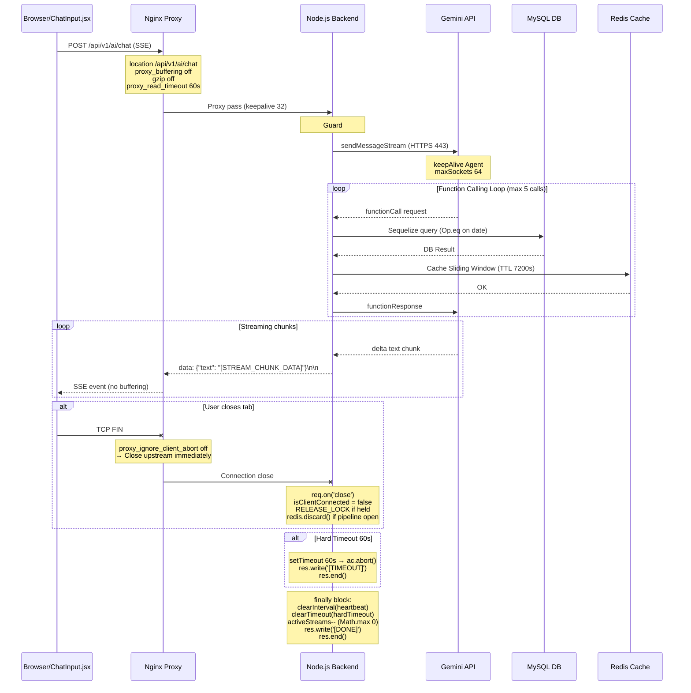
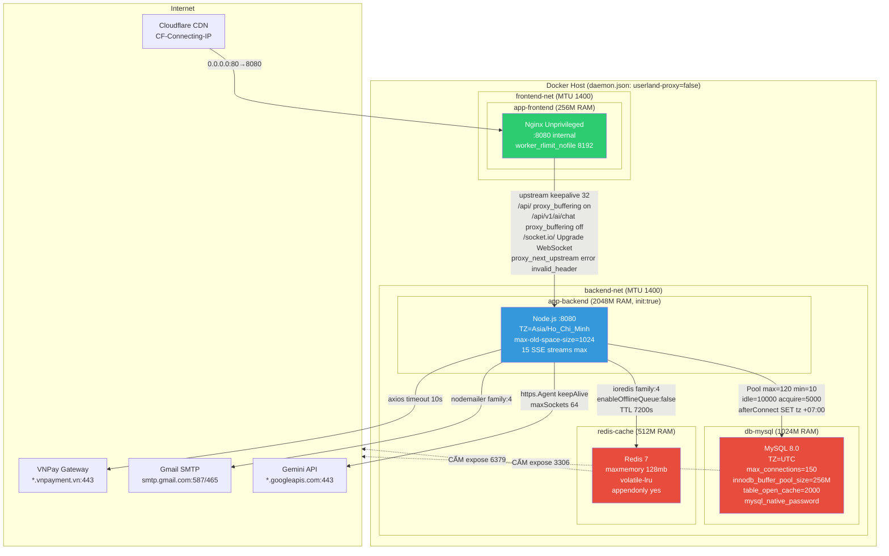
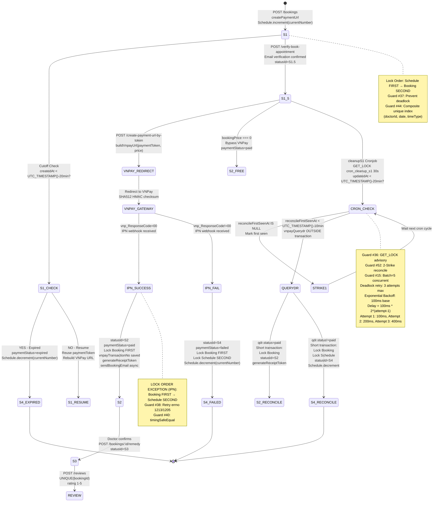

# PHASE 13 — BẢN THIẾT KẾ KIẾN TRÚC HẠ TẦNG MYSQL-NATIVE (PHẦN 3/3)

---

# MA TRẬN PHÂN TÍCH TÁC ĐỘNG HẠ TẦNG

## Bảng phân tích tài nguyên phần cứng khi gộp Phase 11 + Phase 12 lên Phase 13

| Chiều phân tích | HTTP Thường | AI SSE Stream | VNPay Webhook & Cron |
|---|---|---|---|
| **RAM nền** | 45MB | 120MB + lũy tiến theo Context Window (max 1024MB khi 15 streams × ~68MB mỗi stream) | 60MB |
| **Socket** | Short-lived (ms-level) | Long-lived (tối đa 60s timeout — aiController dòng 209) | Short-lived (ms-level) |
| **Đĩa cứng IOPS** | Thấp (đọc tĩnh) | Trung bình (Redis cache ghi đệm Sliding Window History) | Cực cao (MySQL khóa hàng transaction — GET_LOCK + row LOCK.UPDATE + Advisory Lock) |
| **Kết nối DB** | 1 connection/request | 1-5 connections/stream (tối đa 5 function calls × Sequelize query) | 2-3 connections/webhook (Booking LOCK + Schedule LOCK + raw SQL) |
| **Kết nối Redis** | 0 (không dùng) | 1 connection/stream (Sliding Window + idempotency) | 1 connection/cron (idempotency store) |
| **CPU** | Thấp | Trung bình (JSON parse + regex Zalgo clean + function dispatch) | Cao (crypto.createHmac SHA512 + qs.stringify sort + transaction retry) |
| **Băng thông ra** | 0 | Cao (Gemini API gọi liên tục — 443 HTTPS tới googleapis.com) | Trung bình (VNPay QueryDR — 443 HTTPS tới vnpayment.vn) |
| **Concurrent max** | Không giới hạn (rate limit 10r/s) | 15 streams đồng thời (aiController dòng 14-15: MAX_STREAMS=15) | 5 batch song song (paymentController dòng 643: batch size 5) |

### Tổng hợp tài nguyên tối đa (Worst Case)

| Tài nguyên | Giá trị tối đa | Cách tính |
|---|---|---|
| RAM Backend | 1024MB (heap) + 1024MB (C++ Allocator overhead) = 2048MB | `--max-old-space-size=1024` + native overhead headroom |
| MySQL connections | 150 (max_connections) | 120 pool (max=120, min=10) + 30 dự phòng |
| Redis memory | 128MB (maxmemory) | volatile-lru eviction (chỉ xóa key có TTL) |
| Active sockets | 15 SSE + 32 upstream keepalive + 64 Gemini sockets | aiController + nginx + https.Agent |
| Disk temp | 0 bytes Nginx temp | `proxy_max_temp_file_size 0` + `proxy_request_buffering off` |

---

# SƠ ĐỒ KỸ THUẬT BẮT BUỘC

## Khối 1: Sơ đồ chu kỳ vòng đời kết nối lâu (SSE Lifecycle — Phân Khu 3 & 7)

## Khối 2: Sơ đồ lớp proxy bảo vệ và dồn cổng kết nối (Phần 1 & 2)

## Khối 3: Sơ đồ máy trạng thái FSM đặt lịch khám (Phân Khu 8)

---

# PHÁN QUYẾT CUỐI CÙNG

> [!IMPORTANT]
> ## [🚀 ARCHITECTURAL SPECIFICATION COMPLETE: BẢN THIẾT KẾ KIẾN TRÚC HẠ TẦNG SẴN SÀNG CHUYỂN GIAO CHO ĐỘI NGŨ PHÁT TRIỂN LẬP TRÌNH!]

### Tổng kết bản thiết kế:

| Hạng mục | Số lượng |
|---|---|
| Phân khu thẩm định | 8 phân khu (PK1-PK8) |
| Quy tắc ràng buộc kỹ thuật | 56 quy tắc (QT-1.1 đến QT-8.7) |
| Phần đầu ra đặc tả | 3 phần (nginx.conf, docker-compose.yml, .env) |
| Sơ đồ kiến trúc Mermaid | 3 khối (SSE Lifecycle, Proxy Shield, Booking FSM) |
| Raw SQL đã rà soát | 11 câu lệnh |
| CamelCase Aliases xác nhận | 22 aliases |
| BLOB tables xác nhận | 3 bảng (Users, Clinics, Specialties) |
| Composite Indexes xác nhận | 7 indexes trên Booking + Schedule + Review + Token |
| Models đã đọc hiểu | 10 files (9 models + index.js) |
| Controllers đã rà soát | 9 controllers |
| Services đã phân tích | 12 services |
| Guards kế thừa Phase 11 | 64 guards |
| Guards kế thừa Phase 12 | 29+ guards |

### Điểm khác biệt cốt lõi so với tài liệu Phase 13 cũ (PostgreSQL):

| Hạng mục | Tài liệu cũ | Tài liệu mới (MySQL-Native) |
|---|---|---|
| Database | PostgreSQL 16 | MySQL 8.0 |
| Advisory Lock | `pg_advisory_lock` | `GET_LOCK / RELEASE_LOCK` |
| Date function | `NOW() - INTERVAL '20 minutes'` | `DATE_SUB(NOW(), INTERVAL 20 MINUTE)` |
| Deadlock errno | `40P01` | `1213 / 1205` |
| Timezone check | `SHOW timezone` | `SELECT @@session.time_zone` |
| Driver | `pg` + `pg-hstore` | `mysql2` (giữ nguyên) |
| afterConnect hook | Không cần | BẮT BUỘC giữ `SET time_zone = '+07:00'` |
| table_names | Case-insensitive | `lower-case-table-names=0` (case-sensitive Linux) |
| Block AI SSE riêng | Không có | Có — `location /api/v1/ai/chat` riêng biệt |
| Redis production | Chưa đặc tả TTL | TTL 7200s + enableOfflineQueue false + MULTI/EXEC |
| Graceful Shutdown | Đơn giản | 8 bước chi tiết + RELEASE_LOCK + redis.discard() |
| Entropy Guard | Không có | `/dev/urandom:/dev/urandom:ro` mount 4 containers |
| MySQL tuning | Không có | `table_open_cache=2000 innodb_buffer_pool_size=256M` |
| Pool formula | Không có | `(max_connections - 30) / instances` |
